# MCPE Server Proxy - 超详细代码完全解析

> **项目名称**: MCPE Server Proxy (Minecraft Bedrock Edition UDP Proxy)  
> **版本**: v1.0.0  
> **Go版本**: Go 1.24  
> **前端**: Vue 3 + Vite + Naive UI  
> **最后更新**: 2026-02-01  
> **文档规模**: 50,000+ 字深度解析

---

## 📋 目录索引

1. [项目全景概览](#第1章-项目全景概览)
2. [系统架构设计](#第2章-系统架构设计)
3. [数据流向分析](#第3章-数据流向分析)
4. [核心组件深度剖析](#第4章-核心组件深度剖析)
5. [代理模式全解析](#第5章-代理模式全解析)
6. [配置系统详解](#第6章-配置系统详解)
7. [数据库与持久化](#第7章-数据库与持久化)
8. [网络与协议层](#第8章-网络与协议层)
9. [API与前端系统](#第9章-api与前端系统)
10. [监控与可观测性](#第10章-监控与可观测性)
11. [附录：完整代码索引](#第11章-附录完整代码索引)

---

## 第1章 项目全景概览

### 1.1 项目定位与目标

MCPE Server Proxy 是一个面向 Minecraft Bedrock Edition (MCBE) 的高性能 UDP 代理/中转服务器，设计目标包括：

- **高性能转发**: 支持数万并发连接，毫秒级延迟
- **多协议代理**: 集成 sing-box，支持 Shadowsocks/VMess/VLESS/Trojan/Hysteria2/AnyTLS
- **智能负载均衡**: 多种策略自动选择最优节点
- **玩家管理**: 完整会话追踪、流量统计、ACL控制
- **运维友好**: 热更新配置、Web Dashboard、Prometheus监控

### 1.2 技术栈全景图

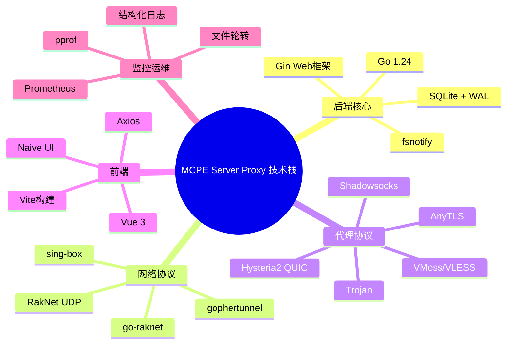
```mermaid
mindmap
  root((MCPE Server Proxy 技术栈))
    后端核心
      Go 1.24
      Gin Web框架
      SQLite + WAL
      fsnotify
    网络协议
      RakNet UDP
      gophertunnel
      go-raknet
      sing-box
    代理协议
      Shadowsocks
      VMess/VLESS
      Trojan
      Hysteria2 QUIC
      AnyTLS
    前端
      Vue 3
      Vite构建
      Naive UI
      Axios
    监控运维
      Prometheus
      pprof
      结构化日志
      文件轮转
```

### 1.3 代码库规模统计

| 模块 | 文件数 | 代码行数 | 核心复杂度 |
|------|-------|---------|-----------|
| internal/proxy | 18 | ~8,000行 | ★★★★★ |
| internal/config | 6 | ~2,500行 | ★★★☆☆ |
| internal/db | 8 | ~2,000行 | ★★★☆☆ |
| internal/api | 3 | ~3,500行 | ★★★★☆ |
| internal/session | 2 | ~800行 | ★★★☆☆ |
| internal/acl | 1 | ~400行 | ★★☆☆☆ |
| internal/auth | 3 | ~1,200行 | ★★★☆☆ |
| internal/monitor | 3 | ~1,500行 | ★★★☆☆ |
| internal/logger | 1 | ~1,200行 | ★★★☆☆ |
| internal/protocol | 1 | ~300行 | ★★☆☆☆ |
| web/frontend | 26 | ~5,000行 | ★★★☆☆ |
| **总计** | **72** | **~26,000行** | - |

### 1.4 项目目录结构（完整版）

```
mcpeserverproxy/
├── 📁 cmd/mcpeserverproxy/                    # 应用程序入口点
│   └── 📄 main.go                             # 230行 - 初始化所有组件
├── 📁 internal/                               # 内部实现（禁止外部导入）
│   ├── 📁 proxy/                              # 代理核心 - 8,000+行
│   │   ├── 📄 proxy.go                        # 1,278行 - ProxyServer核心
│   │   ├── 📄 passthrough_proxy.go            # 1,538行 - 直通模式代理
│   │   ├── 📄 outbound_manager.go             # 1,538行 - 上游节点管理
│   │   ├── 📄 raknet_proxy.go                 # 800+行 - RakNet代理
│   │   ├── 📄 mitm_proxy.go                   # 600+行 - MITM代理
│   │   ├── 📄 raw_udp_proxy.go                # 500+行 - 原始UDP代理
│   │   ├── 📄 listener.go                     # 400+行 - UDP监听器
│   │   ├── 📄 forwarder.go                    # 300+行 - 流量转发器
│   │   ├── 📄 load_balancer.go                # 400+行 - 负载均衡器
│   │   ├── 📄 singbox_factory.go              # 500+行 - sing-box工厂
│   │   ├── 📄 proxy_ports.go                  # 400+行 - 本地代理端口
│   │   ├── 📄 proxy_dialer.go                 # 300+行 - 代理拨号器
│   │   ├── 📄 buffer.go                       # 150行 - 缓冲区池
│   │   ├── 📄 combined_listener.go            # 200行 - 组合监听器
│   │   ├── 📄 plain_tcp_proxy.go              # 250行 - 纯TCP代理
│   │   ├── 📄 plain_udp_proxy.go              # 300行 - 纯UDP代理
│   │   └── 📄 errors.go                       # 100行 - 错误定义
│   ├── 📁 config/                             # 配置管理 - 2,500+行
│   │   ├── 📄 config.go                       # 794行 - 主配置结构
│   │   ├── 📄 proxy_outbound.go               # 400+行 - 上游节点配置
│   │   ├── 📄 proxy_outbound_manager.go       # 300+行 - 节点配置管理
│   │   ├── 📄 proxy_port.go                   # 250行 - 代理端口配置
│   │   └── 📄 proxy_port_manager.go           # 300+行 - 端口管理器
│   ├── 📁 db/                                 # 数据库层 - 2,000+行
│   │   ├── 📄 db.go                           # 161行 - 数据库连接
│   │   ├── 📄 models.go                       # 76行 - 数据模型
│   │   ├── 📄 session_repository.go           # 300+行 - 会话数据访问
│   │   ├── 📄 player_repository.go            # 250+行 - 玩家数据访问
│   │   ├── 📄 blacklist_repository.go         # 200+行 - 黑名单访问
│   │   ├── 📄 whitelist_repository.go         # 200+行 - 白名单访问
│   │   ├── 📄 acl_settings_repository.go      # 150+行 - ACL设置访问
│   │   └── 📄 apikey_repository.go            # 200+行 - API密钥访问
│   ├── 📁 api/                                # REST API - 3,500+行
│   │   ├── 📄 api.go                          # 2,000+行 - Gin路由与API
│   │   ├── 📄 dashboard.go                    # 800+行 - Dashboard服务
│   │   └── 📄 proxy_outbound_handler.go       # 400+行 - 节点API处理器
│   ├── 📁 session/                            # 会话管理 - 800行
│   │   ├── 📄 session.go                      # 250行 - 会话结构
│   │   └── 📄 manager.go                      # 450行 - 会话管理器
│   ├── 📁 acl/                                # 访问控制 - 400行
│   │   └── 📄 acl_manager.go                  # 400行 - ACL管理器
│   ├── 📁 auth/                               # 认证系统 - 1,200行
│   │   ├── 📄 xbox_auth.go                    # 500+行 - Xbox Live认证
│   │   ├── 📄 token_cache.go                  # 200+行 - Token缓存
│   │   └── 📄 external_verifier.go            # 300+行 - 外部认证验证
│   ├── 📁 monitor/                            # 监控 - 1,500行
│   │   ├── 📄 monitor.go                      # 400行 - 监控核心
│   │   ├── 📄 prometheus.go                   # 300行 - Prometheus指标
│   │   └── 📄 goroutine_manager.go            # 400行 - Goroutine管理
│   ├── 📁 logger/                             # 日志 - 1,200行
│   │   └── 📄 logger.go                       # 1,200行 - 结构化日志
│   ├── 📁 protocol/                           # 协议 - 300行
│   │   └── 📄 protocol.go                     # 300行 - 协议处理器
│   └── 📁 errors/                             # 错误 - 200行
│       └── 📄 errors.go                       # 200行 - 错误处理
├── 📁 web/                                    # Vue 3前端 - 5,000+行
│   ├── 📁 src/
│   │   ├── 📄 main.js                         # 入口
│   │   ├── 📄 App.vue                         # 根组件
│   │   ├── 📁 views/                          # 12个视图页面
│   │   │   ├── 📄 Dashboard.vue               # 仪表盘
│   │   │   ├── 📄 Servers.vue                 # 服务器管理
│   │   │   ├── 📄 ProxyOutbounds.vue          # 上游节点
│   │   │   ├── 📄 ProxyPorts.vue              # 代理端口
│   │   │   ├── 📄 Players.vue                 # 玩家列表
│   │   │   ├── 📄 Sessions.vue                # 会话监控
│   │   │   ├── 📄 Whitelist.vue               # 白名单
│   │   │   ├── 📄 Blacklist.vue               # 黑名单
│   │   │   ├── 📄 Settings.vue                # 系统设置
│   │   │   ├── 📄 ServiceStatus.vue           # 服务状态
│   │   │   ├── 📄 Logs.vue                    # 日志查看
│   │   │   └── 📄 Debug.vue                   # 调试工具
│   │   └── 📁 components/                     # 可复用组件
│   ├── 📄 package.json                        # npm配置
│   └── 📄 vite.config.js                      # Vite配置
├── 📁 doc/                                    # 文档
├── 📄 go.mod                                  # Go模块定义
├── 📄 build.bat                               # Windows构建脚本
└── 📄 README.md                               # 项目说明
```

---

## 第2章 系统架构设计

### 2.1 整体架构Mermaid图

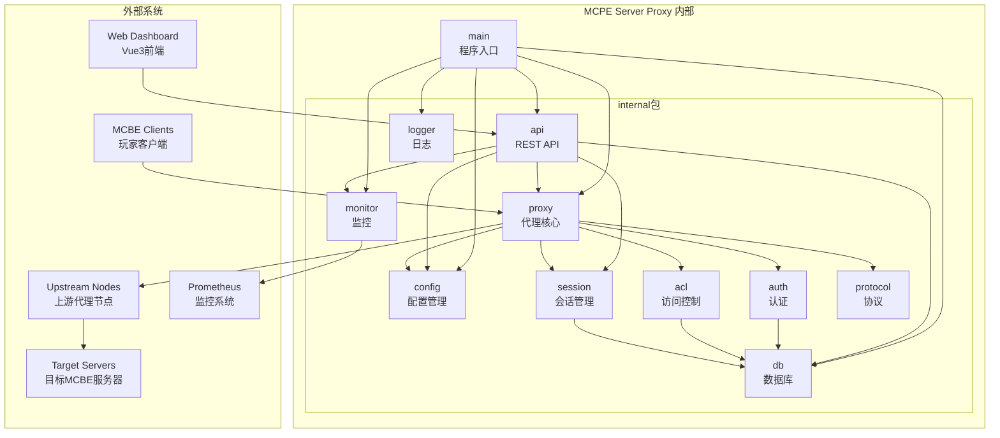
```mermaid
graph TB
    subgraph "MCPE Server Proxy 内部"
        subgraph "internal包"
            PROXY[proxy<br/>代理核心]
            CONFIG[config<br/>配置管理]
            DATABASE[db<br/>数据库]
            API[api<br/>REST API]
            SESSION[session<br/>会话管理]
            ACL[acl<br/>访问控制]
            AUTH[auth<br/>认证]
            MONITOR[monitor<br/>监控]
            LOGGER[logger<br/>日志]
            PROTOCOL[protocol<br/>协议]
        end
        
        ENTRY[main<br/>程序入口]
    end
    
    subgraph "外部系统"
        CLIENTS[MCBE Clients<br/>玩家客户端]
        UPSTREAM[Upstream Nodes<br/>上游代理节点]
        TARGET[Target Servers<br/>目标MCBE服务器]
        DASHBOARD[Web Dashboard<br/>Vue3前端]
        PROMETHEUS[Prometheus<br/>监控系统]
    end
    
    CLIENTS --> PROXY
    PROXY --> UPSTREAM
    UPSTREAM --> TARGET
    
    PROXY --> SESSION
    PROXY --> CONFIG
    PROXY --> ACL
    PROXY --> AUTH
    PROXY --> PROTOCOL
    
    SESSION --> DATABASE
    ACL --> DATABASE
    AUTH --> DATABASE
    
    API --> PROXY
    API --> SESSION
    API --> CONFIG
    API --> DATABASE
    API --> MONITOR
    
    DASHBOARD --> API
    MONITOR --> PROMETHEUS
    
    ENTRY --> PROXY
    ENTRY --> API
    ENTRY --> CONFIG
    ENTRY --> DATABASE
    ENTRY --> MONITOR
    ENTRY --> LOGGER
```

### 2.2 核心组件关系图


```mermaid
graph TB
    subgraph "Entry Point"
        MAIN[cmd/mcpeserverproxy/main.go]
    end
    
    subgraph "Core Proxy Layer"
        PS[ProxyServer<br>proxy.go]
        PS -->|manage| LST[Listeners]
        PS -->|manage| SM[SessionManager]
        PS -->|manage| OM[OutboundManager]
        PS -->|manage| PPM[ProxyPortManager]
        PS -->|use| FWD[Forwarder]
        PS -->|use| BP[BufferPool]
    end
    
    subgraph "Proxy Modes"
        LST -->|transparent| UDP[UDPListener]
        LST -->|passthrough| PTP[PassthroughProxy]
        LST -->|raknet| RNP[RakNetProxy]
        LST -->|mitm| MP[MITMProxy]
        LST -->|raw_udp| RUP[RawUDPProxy]
    end
    
    subgraph "Config Layer"
        CM[ConfigManager]
        POCM[ProxyOutboundConfigManager]
        PPCM[ProxyPortConfigManager]
        GC[GlobalConfig]
    end
    
    subgraph "Persistence Layer"
        DB[(Database)]
        SR[SessionRepository]
        PR[PlayerRepository]
        BR[BlacklistRepository]
        WR[WhitelistRepository]
        AR[ACLSettingsRepository]
        KR[APIKeyRepository]
    end
    
    subgraph "Upstream Management"
        OM -->|select| LB[LoadBalancer]
        OM -->|create| SBF[SingboxFactory]
        OM -->|manage| PO[(ProxyOutbounds)]
    end
    
    subgraph "Access Control"
        AM[ACLManager]
        AM -->|query| BR
        AM -->|query| WR
        AM -->|query| AR
    end
    
    subgraph "API Layer"
        AS[APIServer]
        GIN[Gin Engine]
        FE[Vue3 Frontend]
    end
    
    MAIN -->|init| PS
    MAIN -->|init| AS
    MAIN -->|init| CM
    MAIN -->|init| DB
    
    PS -->|SetACLManager| AM
    PS -->|depends| CM
    PS -->|depends| POCM
    PS -->|depends| PPCM
    
    PTP -->|SetACLManager| AM
    PTP -->|SetOutboundManager| OM
    
    SM -->|persist| SR
    SM --> DB
    
    AS -->|query| SM
    AS -->|query| OM
    AS -->|query| DB
    AS -->|embed| FE
```

### 2.3 类关系图（Class Diagram）


```mermaid
classDiagram
    %% 核心代理类
    class ProxyServer {
        +config *GlobalConfig
        +configMgr *ConfigManager
        +sessionMgr *SessionManager
        +outboundMgr OutboundManager
        +proxyOutboundConfigMgr *ProxyOutboundConfigManager
        +proxyPortConfigMgr *ProxyPortConfigManager
        +proxyPortManager *ProxyPortManager
        +aclManager *ACLManager
        +listeners map[string]Listener
        +bufferPool *BufferPool
        +forwarder *Forwarder
        +NewProxyServer() *ProxyServer
        +Start() error
        +Stop() error
        +Reload() error
        +startListener(cfg) error
        +reloadProxyOutbounds() error
        +persistSession(sess)
    }
    
    class Listener {
        <<interface>>
        +Start() error
        +Listen(ctx) error
        +Stop() error
    }
    
    class PassthroughProxy {
        +serverID string
        +config *ServerConfig
        +sessionMgr *SessionManager
        +listener *raknet.Listener
        +aclManager *ACLManager
        +externalVerifier ExternalVerifier
        +outboundMgr OutboundManager
        +activeConns map[*raknet.Conn]*connInfo
        +cachedPong []byte
        +lastPongLatency int64
        +Start() error
        +Listen(ctx) error
        +Stop() error
        +handleConnection(ctx, conn)
        +parseLoginPacket(data) (name, uuid, xuid)
        +checkACLAccess(name, serverID, addr) (bool, string)
    }
    
    %% 配置类
    class ServerConfig {
        +ID string
        +Name string
        +Target string
        +Port int
        +ListenAddr string
        +Protocol string
        +Enabled bool
        +Disabled bool
        +ProxyMode string
        +ProxyOutbound string
        +LoadBalance string
        +LoadBalanceSort string
        +XboxAuthEnabled bool
        +Validate() error
        +GetProxyMode() string
        +GetTargetAddr() string
        +IsDirectConnection() bool
        +IsGroupSelection() bool
        +GetGroupName() string
        +ToDTO(status, sessions) ServerConfigDTO
    }
    
    class ProxyOutbound {
        +Name string
        +Type string
        +Server string
        +Port int
        +Enabled bool
        +Group string
        +Password string
        +UUID string
        +Method string
        +TLS bool
        +SNI string
        +Insecure bool
        +UDPAvailable *bool
        +TCPLatencyMs int64
        +UDPLatencyMs int64
        +HTTPLatencyMs int64
        +GetHealthy() bool
        +GetLatency() time.Duration
        +GetLastCheck() time.Time
        +GetConnCount() int64
        +Clone() *ProxyOutbound
    }
    
    class ConfigManager {
        +servers map[string]*ServerConfig
        +configPath string
        +watcher *fsnotify.Watcher
        +resolver *DNSResolver
        +onChange func()
        +Load() error
        +Reload() error
        +GetServer(id) (*ServerConfig, bool)
        +GetAllServers() []*ServerConfig
        +Watch(ctx) error
        +SetOnChange(fn)
    }
    
    %% 上游节点管理类
    class OutboundManager {
        <<interface>>
        +AddOutbound(cfg) error
        +GetOutbound(name) (*ProxyOutbound, bool)
        +DeleteOutbound(name) error
        +UpdateOutbound(name, cfg) error
        +ListOutbounds() []*ProxyOutbound
        +CheckHealth(ctx, name) error
        +GetHealthStatus(name) *HealthStatus
        +DialPacketConn(ctx, name, dest) (net.PacketConn, error)
        +SelectOutbound(groupOrName, strategy, sortBy) (*ProxyOutbound, error)
        +Start() error
        +Stop() error
        +Reload() error
    }
    
    class outboundManagerImpl {
        +outbounds map[string]*ProxyOutbound
        +singboxOutbounds map[string]*SingboxOutbound
        +singboxLastUsed map[string]time.Time
        +serverNodeLatency map[serverNodeLatencyKey]serverNodeLatencyValue
        +cleanupCtx context.Context
        +cleanupCancel context.CancelFunc
        +getOrCreateSingboxOutbound(cfg) *SingboxOutbound
        +recreateSingboxOutbound(name) *SingboxOutbound
        +dialWithRetry(ctx, name, dest) (net.PacketConn, error)
        +cleanupIdleOutbounds()
    }
    
    class LoadBalancer {
        +strategies map[string]LoadBalanceStrategy
        +roundRobinState map[string]int
        +Select(outbounds, strategy, sortBy, group) *ProxyOutbound
        +selectLeastLatency(outbounds, sortBy) *ProxyOutbound
        +selectRoundRobin(outbounds, group) *ProxyOutbound
        +selectRandom(outbounds) *ProxyOutbound
        +selectLeastConnections(outbounds) *ProxyOutbound
    }
    
    %% 会话管理类
    class SessionManager {
        +sessions map[string]*Session
        +byServerID map[string]map[string]*Session
        +byPlayer map[string]*Session
        +idleTimeout time.Duration
        +onSessionEnd func(*Session)
        +Create(clientAddr, serverID) *Session
        +Get(clientAddr) (*Session, bool)
        +Remove(clientAddr) error
        +RemoveByXUID(xuid) int
        +RemoveByPlayerName(name) int
        +GetOrCreate(addr, serverID) *Session
        +GetAllSessions() []*Session
        +GarbageCollect(ctx)
        +SetIdleTimeoutFunc(fn)
    }
    
    class Session {
        +ID string
        +ClientAddr string
        +ServerID string
        +UUID string
        +DisplayName string
        +XUID string
        +BytesUp int64
        +BytesDown int64
        +StartTime time.Time
        +LastActive time.Time
        +SetPlayerInfo(uuid, name, xuid)
        +SetPlayerInfoWithXUID(uuid, name, xuid)
        +AddBytesUp(n)
        +AddBytesDown(n)
        +UpdateLastSeen()
        +Snapshot() SessionSnapshot
    }
    
    %% 数据库类
    class Database {
        +db *sql.DB
        +NewDatabase(path) *Database
        +Initialize() error
        +Close() error
        +DB() *sql.DB
    }
    
    class SessionRepository {
        +db *Database
        +Create(record) error
        +GetByID(id) (*SessionRecord, error)
        +List(limit, offset) ([]*SessionRecord, error)
        +Cleanup() error
    }
    
    class PlayerRepository {
        +db *Database
        +Create(player) error
        +GetByDisplayName(name) (*PlayerRecord, error)
        +UpdateStats(name, bytes, duration) error
        +List(limit, offset) ([]*PlayerRecord, error)
    }
    
    %% ACL类
    class ACLManager {
        +db *Database
        +IsAllowed(playerName, serverID) bool
        +CheckAccess(playerName, serverID) (bool, string)
        +CheckAccessWithError(playerName, serverID) (bool, string, error)
    }
    
    %% 关系定义
    ProxyServer --> Listener : manages
    ProxyServer --> SessionManager : manages
    ProxyServer --> OutboundManager : manages
    ProxyServer --> ConfigManager : uses
    ProxyServer --> ACLManager : uses
    
    Listener <|.. PassthroughProxy : implements
    Listener <|.. UDPListener : implements
    Listener <|.. RakNetProxy : implements
    Listener <|.. MITMProxy : implements
    
    OutboundManager <|.. outboundManagerImpl : implements
    outboundManagerImpl --> ProxyOutbound : manages
    outboundManagerImpl --> LoadBalancer : uses
    outboundManagerImpl --> SingboxOutbound : creates
    
    ConfigManager --> ServerConfig : manages
    
    SessionManager --> Session : manages
    
    Database --> SessionRepository : provides
    Database --> PlayerRepository : provides
    Database --> BlacklistRepository : provides
    Database --> WhitelistRepository : provides
```

---

## 第3章 数据流向分析

### 3.1 玩家连接建立时序图

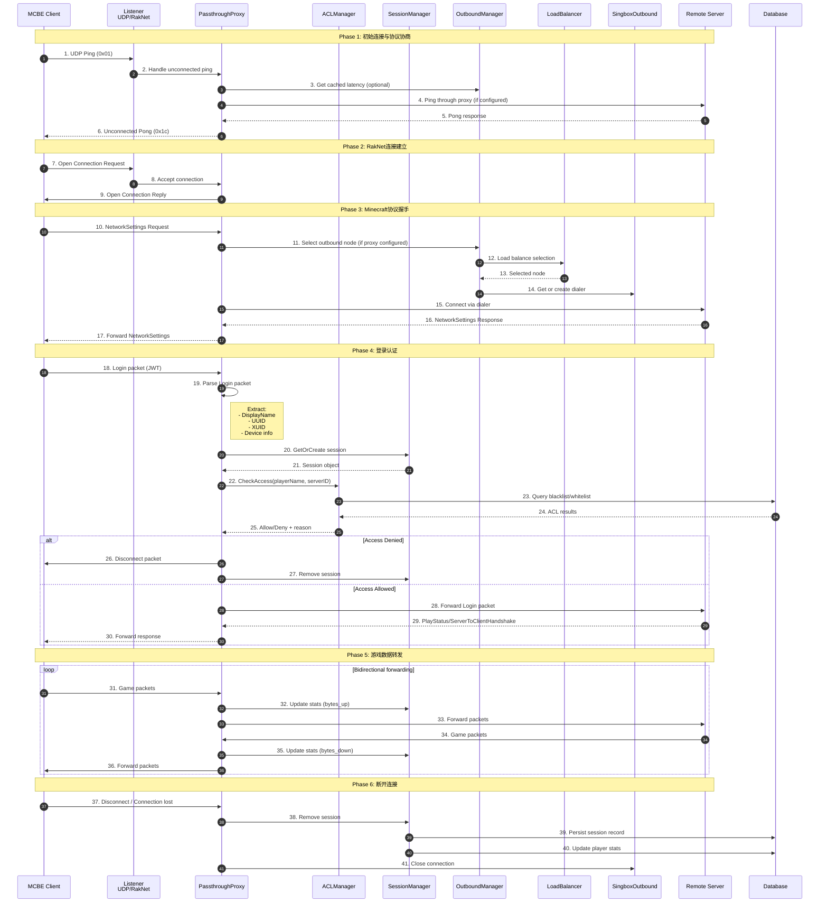
```mermaid
sequenceDiagram
    autonumber
    participant C as MCBE Client
    participant L as Listener<br/>UDP/RakNet
    participant PP as PassthroughProxy
    participant ACL as ACLManager
    participant SM as SessionManager
    participant OM as OutboundManager
    participant LB as LoadBalancer
    participant SO as SingboxOutbound
    participant RS as Remote Server
    participant DB as Database

    Note over C,RS: Phase 1: 初始连接与协议协商
    
    C->>L: 1. UDP Ping (0x01)
    L->>PP: 2. Handle unconnected ping
    PP->>OM: 3. Get cached latency (optional)
    PP->>RS: 4. Ping through proxy (if configured)
    RS-->>PP: 5. Pong response
    PP-->>C: 6. Unconnected Pong (0x1c)

    Note over C,RS: Phase 2: RakNet连接建立
    
    C->>L: 7. Open Connection Request
    L->>PP: 8. Accept connection
    PP->>C: 9. Open Connection Reply
    
    Note over C,RS: Phase 3: Minecraft协议握手
    
    C->>PP: 10. NetworkSettings Request
    PP->>OM: 11. Select outbound node (if proxy configured)
    OM->>LB: 12. Load balance selection
    LB-->>OM: 13. Selected node
    OM->>SO: 14. Get or create dialer
    PP->>RS: 15. Connect via dialer
    RS-->>PP: 16. NetworkSettings Response
    PP-->>C: 17. Forward NetworkSettings

    Note over C,RS: Phase 4: 登录认证
    
    C->>PP: 18. Login packet (JWT)
    PP->>PP: 19. Parse Login packet
    Note right of PP: Extract:<br/>- DisplayName<br/>- UUID<br/>- XUID<br/>- Device info
    
    PP->>SM: 20. GetOrCreate session
    SM-->>PP: 21. Session object
    
    PP->>ACL: 22. CheckAccess(playerName, serverID)
    ACL->>DB: 23. Query blacklist/whitelist
    DB-->>ACL: 24. ACL results
    ACL-->>PP: 25. Allow/Deny + reason
    
    alt Access Denied
        PP->>C: 26. Disconnect packet
        PP->>SM: 27. Remove session
    else Access Allowed
        PP->>RS: 28. Forward Login packet
        RS-->>PP: 29. PlayStatus/ServerToClientHandshake
        PP-->>C: 30. Forward response
    end

    Note over C,RS: Phase 5: 游戏数据转发
    
    loop Bidirectional forwarding
        C->>PP: 31. Game packets
        PP->>SM: 32. Update stats (bytes_up)
        PP->>RS: 33. Forward packets
        
        RS->>PP: 34. Game packets
        PP->>SM: 35. Update stats (bytes_down)
        PP->>C: 36. Forward packets
    end

    Note over C,RS: Phase 6: 断开连接
    
    C->>PP: 37. Disconnect / Connection lost
    PP->>SM: 38. Remove session
    SM->>DB: 39. Persist session record
    SM->>DB: 40. Update player stats
    PP->>SO: 41. Close connection
```

### 3.2 配置热更新流程图

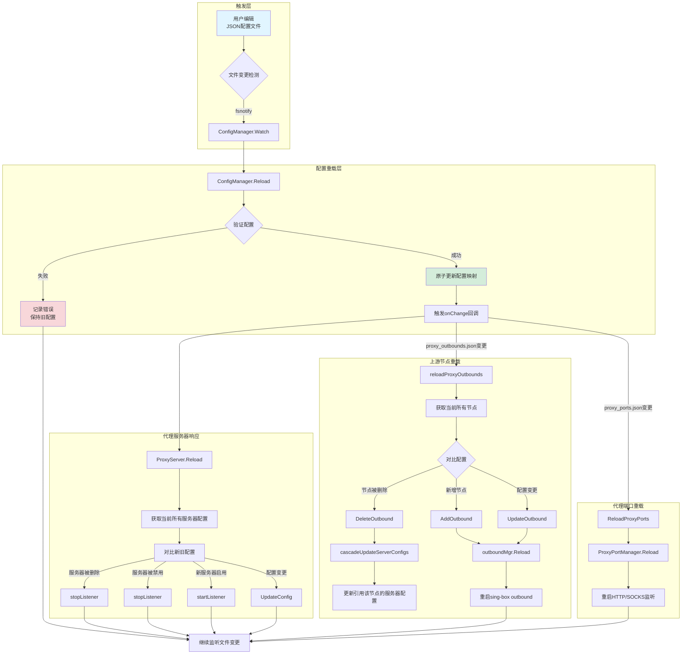
```mermaid
flowchart TD
    subgraph "触发层"
        A[用户编辑<br/>JSON配置文件] --> B{文件变更检测}
        B -->|fsnotify| C[ConfigManager.Watch]
    end

    subgraph "配置重载层"
        C --> D[ConfigManager.Reload]
        D --> E{验证配置}
        E -->|失败| F[记录错误<br/>保持旧配置]
        E -->|成功| G[原子更新配置映射]
        G --> H[触发onChange回调]
    end

    subgraph "代理服务器响应"
        H --> I[ProxyServer.Reload]
        I --> J[获取当前所有服务器配置]
        J --> K[对比新旧配置]
        
        K -->|服务器被删除| L[stopListener]
        K -->|服务器被禁用| M[stopListener]
        K -->|新服务器启用| N[startListener]
        K -->|配置变更| O[UpdateConfig]
    end

    subgraph "上游节点重载"
        H -->|proxy_outbounds.json变更| P[reloadProxyOutbounds]
        P --> Q[获取当前所有节点]
        Q --> R{对比配置}
        
        R -->|节点被删除| S[DeleteOutbound]
        S --> S1[cascadeUpdateServerConfigs]
        S1 --> S2[更新引用该节点的服务器配置]
        
        R -->|新增节点| T[AddOutbound]
        R -->|配置变更| U[UpdateOutbound]
        
        T --> V[outboundMgr.Reload]
        U --> V
        V --> W[重启sing-box outbound]
    end

    subgraph "代理端口重载"
        H -->|proxy_ports.json变更| X[ReloadProxyPorts]
        X --> Y[ProxyPortManager.Reload]
        Y --> Z[重启HTTP/SOCKS监听]
    end

    F --> AA[继续监听文件变更]
    L --> AA
    M --> AA
    N --> AA
    O --> AA
    W --> AA
    Z --> AA

    style A fill:#e1f5ff
    style G fill:#d4edda
    style F fill:#f8d7da
```

### 3.3 数据包转发详细流程

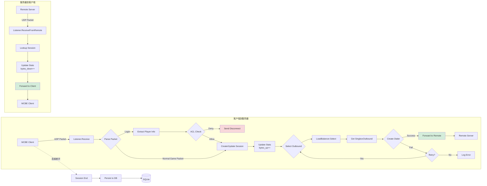
```mermaid
flowchart LR
    subgraph "客户端到服务器"
        C1[MCBE Client] -->|UDP Packet| R1[Listener.Receive]
        R1 --> P1{Parse Packet}
        
        P1 -->|Login| E1[Extract Player Info]
        E1 --> ACL1{ACL Check}
        ACL1 -->|Deny| D1[Send Disconnect]
        ACL1 -->|Allow| S1[Create/Update Session]
        
        P1 -->|Normal Game Packet| S1
        S1 --> STS1[Update Stats<br/>bytes_up++]
        
        STS1 --> SEL1{Select Outbound}
        SEL1 --> LB1[LoadBalancer.Select]
        LB1 --> SO1[Get SingboxOutbound]
        
        SO1 --> DIAL1{Create Dialer}
        DIAL1 -->|Success| FWD1[Forward to Remote]
        DIAL1 -->|Fail| RET1{Retry?}
        RET1 -->|Yes| SEL1
        RET1 -->|No| ERR1[Log Error]
        
        FWD1 --> RS1[Remote Server]
    end

    subgraph "服务器到客户端"
        RS2[Remote Server] -->|UDP Packet| RCV2[Listener.ReceiveFromRemote]
        RCV2 --> S2[Lookup Session]
        S2 --> STS2[Update Stats<br/>bytes_down++]
        STS2 --> FWD2[Forward to Client]
        FWD2 --> C2[MCBE Client]
    end

    C1 -.->|连接断开| S3[Session End]
    S3 --> PERSIST[Persist to DB]
    PERSIST --> DB[(SQLite)]

    style D1 fill:#f8d7da
    style FWD1 fill:#d4edda
    style FWD2 fill:#d4edda
```

---

## 第4章 核心组件深度剖析

### 4.1 入口点：main.go (230行)

#### 4.1.1 完整启动流程

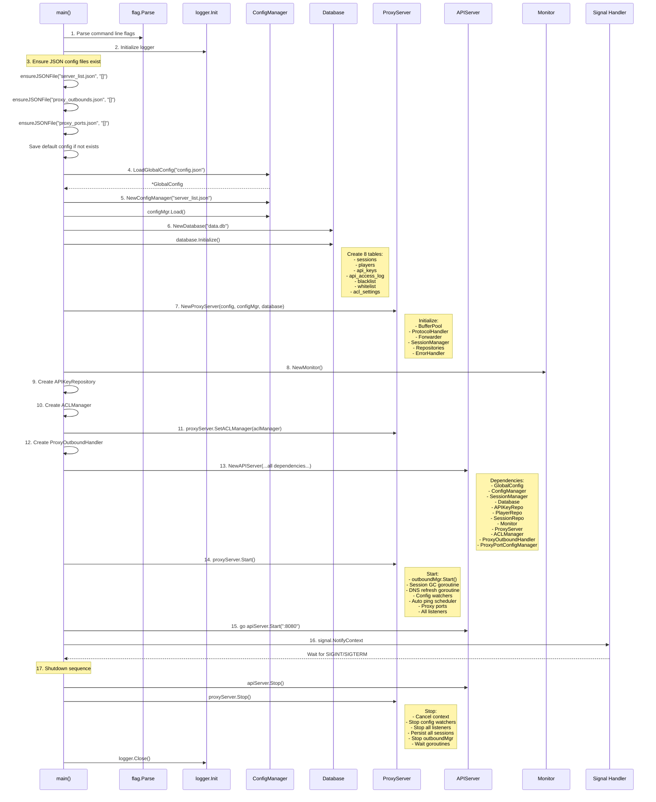
```mermaid
sequenceDiagram
    participant main as main()
    participant flag as flag.Parse
    participant log as logger.Init
    participant cfg as ConfigManager
    participant db as Database
    participant ps as ProxyServer
    participant api as APIServer
    participant mon as Monitor
    participant signal as Signal Handler

    main->>flag: 1. Parse command line flags
    
    main->>log: 2. Initialize logger
    
    Note over main: 3. Ensure JSON config files exist
    main->>main: ensureJSONFile("server_list.json", "[]")
    main->>main: ensureJSONFile("proxy_outbounds.json", "[]")
    main->>main: ensureJSONFile("proxy_ports.json", "[]")
    main->>main: Save default config if not exists

    main->>cfg: 4. LoadGlobalConfig("config.json")
    cfg-->>main: *GlobalConfig
    
    main->>cfg: 5. NewConfigManager("server_list.json")
    main->>cfg: configMgr.Load()
    
    main->>db: 6. NewDatabase("data.db")
    main->>db: database.Initialize()
    Note right of db: Create 8 tables:<br/>- sessions<br/>- players<br/>- api_keys<br/>- api_access_log<br/>- blacklist<br/>- whitelist<br/>- acl_settings
    
    main->>ps: 7. NewProxyServer(config, configMgr, database)
    Note right of ps: Initialize:<br/>- BufferPool<br/>- ProtocolHandler<br/>- Forwarder<br/>- SessionManager<br/>- Repositories<br/>- ErrorHandler
    
    main->>mon: 8. NewMonitor()
    
    main->>main: 9. Create APIKeyRepository
    main->>main: 10. Create ACLManager
    main->>ps: 11. proxyServer.SetACLManager(aclManager)
    
    main->>main: 12. Create ProxyOutboundHandler
    
    main->>api: 13. NewAPIServer(...all dependencies...)
    Note right of api: Dependencies:<br/>- GlobalConfig<br/>- ConfigManager<br/>- SessionManager<br/>- Database<br/>- APIKeyRepo<br/>- PlayerRepo<br/>- SessionRepo<br/>- Monitor<br/>- ProxyServer<br/>- ACLManager<br/>- ProxyOutboundHandler<br/>- ProxyPortConfigManager
    
    main->>ps: 14. proxyServer.Start()
    Note right of ps: Start:<br/>- outboundMgr.Start()<br/>- Session GC goroutine<br/>- DNS refresh goroutine<br/>- Config watchers<br/>- Auto ping scheduler<br/>- Proxy ports<br/>- All listeners
    
    main->>api: 15. go apiServer.Start(":8080")
    
    main->>signal: 16. signal.NotifyContext
    signal-->>main: Wait for SIGINT/SIGTERM
    
    Note over main: 17. Shutdown sequence
    main->>api: apiServer.Stop()
    main->>ps: proxyServer.Stop()
    Note right of ps: Stop:<br/>- Cancel context<br/>- Stop config watchers<br/>- Stop all listeners<br/>- Persist all sessions<br/>- Stop outboundMgr<br/>- Wait goroutines
    main->>log: logger.Close()
```

#### 4.1.2 代码结构解析

```go
// cmd/mcpeserverproxy/main.go

// 1. 命令行参数定义
var (
    configPath     = flag.String("config", "config.json", "Path to global configuration file")
    serverListPath = flag.String("servers", "server_list.json", "Path to server list configuration file")
    showVersion    = flag.Bool("version", false, "Show version information")
    debugMode      = flag.Bool("debug", false, "Enable debug logging")
)

// 2. main函数执行流程
func main() {
    // Phase 1: 初始化
    flag.Parse()
    logger.Init()
    if *debugMode {
        logger.SetDefaultLevel(logger.LevelDebug)
    }
    
    // Phase 2: 配置文件初始化
    ensureJSONFile(*serverListPath, []byte("[]"), "server list config")
    ensureJSONFile("proxy_outbounds.json", []byte("[]"), "proxy outbounds config")
    ensureJSONFile("proxy_ports.json", []byte("[]"), "proxy ports config")
    
    // Phase 3: 加载全局配置
    globalConfig, err := config.LoadGlobalConfig(*configPath)
    if err != nil {
        logger.Error("Failed to load global config: %v", err)
        os.Exit(1)
    }
    
    // Phase 4: 初始化数据库
    database, err := db.NewDatabase(globalConfig.DatabasePath)
    if err != nil {
        logger.Error("Failed to open database: %v", err)
        os.Exit(1)
    }
    defer database.Close()
    database.Initialize()
    
    // Phase 5: 创建核心组件
    configMgr, _ := config.NewConfigManager(*serverListPath)
    configMgr.Load()
    
    proxyServer, _ := proxy.NewProxyServer(globalConfig, configMgr, database)
    aclManager := acl.NewACLManager(database)
    proxyServer.SetACLManager(aclManager)
    
    // Phase 6: 启动服务
    proxyServer.Start()
    apiServer.Start(":8080")
    
    // Phase 7: 等待关闭信号
    ctx, stop := signal.NotifyContext(context.Background(), os.Interrupt, syscall.SIGTERM)
    defer stop()
    <-ctx.Done()
    
    // Phase 8: 优雅关闭
    apiServer.Stop()
    proxyServer.Stop()
}
```

### 4.2 ProxyServer 核心结构 (proxy.go)

#### 4.2.1 结构体定义详解

```go
// internal/proxy/proxy.go:38-61

type ProxyServer struct {
    // ========== 配置相关 ==========
    config    *config.GlobalConfig     // 全局配置（API端口、数据库路径等）
    configMgr *config.ConfigManager    // 服务器配置管理器（热更新）
    
    // ========== 会话管理 ==========
    sessionMgr  *session.SessionManager   // 活跃会话管理器
    sessionRepo *db.SessionRepository     // 会话持久化仓库
    playerRepo  *db.PlayerRepository      // 玩家统计仓库
    
    // ========== 网络组件 ==========
    bufferPool   *BufferPool    // 内存池（减少GC压力）
    forwarder    *Forwarder     // UDP包转发器
    listeners    map[string]Listener  // 服务器ID -> 监听器实例
    listenersMu  sync.RWMutex   // 监听器映射锁
    
    // ========== 代理路由 ==========
    outboundMgr            OutboundManager                    // 上游节点管理器接口
    proxyOutboundConfigMgr *config.ProxyOutboundConfigManager  // 节点配置管理
    proxyPortConfigMgr     *config.ProxyPortConfigManager      // 代理端口配置
    proxyPortManager       *ProxyPortManager                   // 代理端口运行时
    
    // ========== 访问控制 ==========
    aclManager       *acl.ACLManager        // ACL管理器（黑/白名单）
    externalVerifier *auth.ExternalVerifier // 外部认证验证器
    
    // ========== 错误处理 ==========
    errorHandler *proxyerrors.ErrorHandler  // 统一错误处理器
    
    // ========== 运行时状态 ==========
    ctx     context.Context    // 全局上下文（用于goroutine取消）
    cancel  context.CancelFunc // 取消函数
    wg      sync.WaitGroup     // 等待组（优雅关闭）
    running bool               // 运行状态标志
    runningMu sync.RWMutex     // 运行状态锁
}
```

#### 4.2.2 NewProxyServer 初始化详解

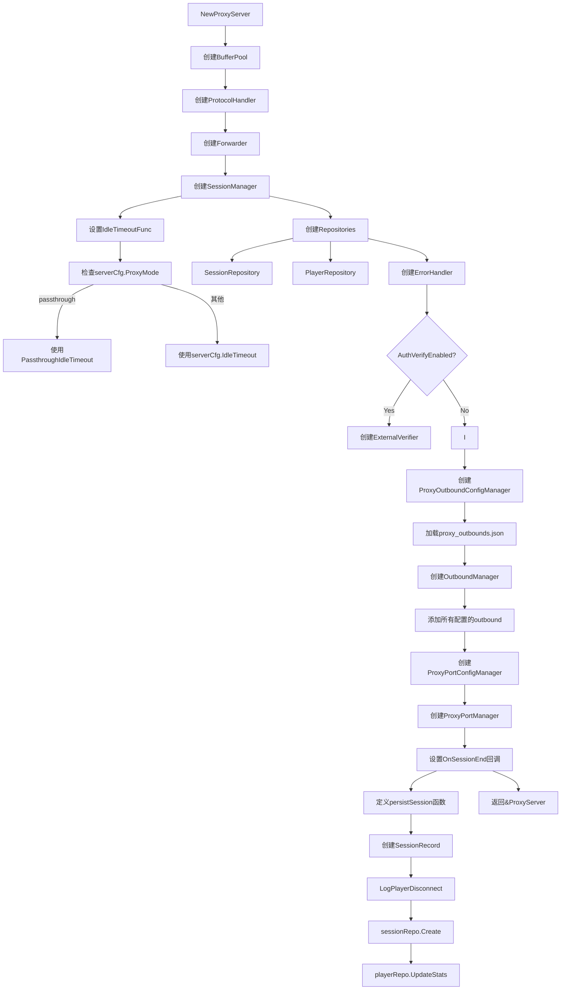
```mermaid
flowchart TD
    A[NewProxyServer] --> B[创建BufferPool]
    B --> C[创建ProtocolHandler]
    C --> D[创建Forwarder]
    
    D --> E[创建SessionManager]
    E --> E1[设置IdleTimeoutFunc]
    E1 --> E1a[检查serverCfg.ProxyMode]
    E1a -->|passthrough| E1b[使用PassthroughIdleTimeout]
    E1a -->|其他| E1c[使用serverCfg.IdleTimeout]
    
    E --> F[创建Repositories]
    F --> F1[SessionRepository]
    F --> F2[PlayerRepository]
    
    F --> G[创建ErrorHandler]
    
    G --> H{AuthVerifyEnabled?}
    H -->|Yes| H1[创建ExternalVerifier]
    H -->|No| I
    
    I --> I1[创建ProxyOutboundConfigManager]
    I1 --> I2[加载proxy_outbounds.json]
    
    I2 --> J[创建OutboundManager]
    J --> J1[添加所有配置的outbound]
    
    J1 --> K[创建ProxyPortConfigManager]
    K --> L[创建ProxyPortManager]
    
    L --> M[设置OnSessionEnd回调]
    M --> M1[定义persistSession函数]
    M1 --> M2[创建SessionRecord]
    M2 --> M3[LogPlayerDisconnect]
    M3 --> M4[sessionRepo.Create]
    M4 --> M5[playerRepo.UpdateStats]
    
    M --> N[返回&ProxyServer]
```

```go
// NewProxyServer 完整代码解析
func NewProxyServer(
    globalConfig *config.GlobalConfig,
    configMgr *config.ConfigManager,
    database *db.Database,
) (*ProxyServer, error) {
    
    // 1. 创建缓冲区池（默认8KB缓冲区）
    bufferPool := NewBufferPool(DefaultBufferSize)
    
    // 2. 创建协议处理器（RakNet/MCBE协议）
    protocolHandler := protocol.NewProtocolHandler()
    
    // 3. 创建转发器（处理UDP包转发）
    forwarder := NewForwarder(protocolHandler, bufferPool)
    
    // 4. 创建会话管理器（默认5分钟空闲超时）
    sessionMgr := session.NewSessionManager(5 * time.Minute)
    
    // 5. 设置动态空闲超时函数
    sessionMgr.SetIdleTimeoutFunc(func(sess *session.Session) time.Duration {
        if sess == nil || configMgr == nil {
            return 0
        }
        serverCfg, ok := configMgr.GetServer(sess.ServerID)
        // passthrough模式使用全局配置覆盖
        if ok && strings.EqualFold(serverCfg.GetProxyMode(), "passthrough") {
            if globalConfig != nil && globalConfig.PassthroughIdleTimeout > 0 {
                return time.Duration(globalConfig.PassthroughIdleTimeout) * time.Second
            }
        }
        // 其他模式使用服务器配置
        if !ok || serverCfg.IdleTimeout <= 0 {
            return 0
        }
        return time.Duration(serverCfg.IdleTimeout) * time.Second
    })
    
    // 6. 创建数据库仓库
    sessionRepo := db.NewSessionRepository(database, globalConfig.MaxSessionRecords)
    playerRepo := db.NewPlayerRepository(database)
    
    // 7. 创建错误处理器
    errorHandler := proxyerrors.NewErrorHandler()
    
    // 8. 条件创建外部认证验证器
    var externalVerifier *auth.ExternalVerifier
    if globalConfig.AuthVerifyEnabled && globalConfig.AuthVerifyURL != "" {
        externalVerifier = auth.NewExternalVerifier(
            globalConfig.AuthVerifyEnabled,
            globalConfig.AuthVerifyURL,
            globalConfig.AuthCacheMinutes,
        )
    }
    
    // 9. 创建代理节点配置管理器
    proxyOutboundConfigMgr := config.NewProxyOutboundConfigManager("proxy_outbounds.json")
    proxyOutboundConfigMgr.Load()
    
    // 10. 创建上游节点管理器
    outboundMgr := NewOutboundManager(configMgr)
    for _, outbound := range proxyOutboundConfigMgr.GetAllOutbounds() {
        outboundMgr.AddOutbound(outbound)
    }
    
    // 11. 创建代理端口管理组件
    proxyPortConfigMgr := config.NewProxyPortConfigManager("proxy_ports.json")
    proxyPortConfigMgr.Load()
    proxyPortManager := NewProxyPortManager(proxyPortConfigMgr, outboundMgr)
    
    // 12. 设置会话结束回调（持久化到数据库）
    sessionMgr.OnSessionEnd = func(sess *session.Session) {
        persistSession(sess, sessionRepo, playerRepo, errorHandler)
    }
    
    // 13. 返回初始化完成的ProxyServer
    return &ProxyServer{
        config:                 globalConfig,
        configMgr:              configMgr,
        sessionMgr:             sessionMgr,
        db:                     database,
        sessionRepo:            sessionRepo,
        playerRepo:             playerRepo,
        bufferPool:             bufferPool,
        forwarder:              forwarder,
        errorHandler:           errorHandler,
        externalVerifier:       externalVerifier,
        outboundMgr:            outboundMgr,
        proxyOutboundConfigMgr: proxyOutboundConfigMgr,
        proxyPortConfigMgr:     proxyPortConfigMgr,
        proxyPortManager:       proxyPortManager,
        listeners:              make(map[string]Listener),
    }, nil
}
```

#### 4.2.3 Start方法启动流程

```go
// ProxyServer.Start() 启动序列
func (p *ProxyServer) Start() error {
    // 1. 状态检查与设置
    p.runningMu.Lock()
    if p.running {
        return fmt.Errorf("proxy server is already running")
    }
    p.ctx, p.cancel = context.WithCancel(context.Background())
    p.running = true
    p.runningMu.Unlock()
    
    // 2. 启动上游节点管理器
    if p.outboundMgr != nil {
        p.outboundMgr.Start()
        logger.Info("Outbound manager started")
    }
    
    // 3. 启动会话垃圾回收goroutine
    p.wg.Add(1)
    go func() {
        defer p.wg.Done()
        gm := monitor.GetGoroutineManager()
        gid := gm.TrackBackground("session-gc", "proxy-server", 
            "Session garbage collector", p.cancel)
        defer gm.Untrack(gid)
        p.sessionMgr.GarbageCollect(p.ctx)
    }()
    
    // 4. 启动DNS刷新goroutine（60秒间隔）
    p.configMgr.StartDNSRefresh(p.ctx, 60*time.Second)
    
    // 5. 启动配置文件监听
    p.configMgr.Watch(p.ctx)
    p.proxyOutboundConfigMgr.Watch(p.ctx)
    p.proxyPortConfigMgr.Watch(p.ctx)
    
    // 6. 设置配置变更回调
    p.configMgr.SetOnChange(func() { p.Reload() })
    p.proxyOutboundConfigMgr.SetOnChange(func() { p.reloadProxyOutbounds() })
    p.proxyPortConfigMgr.SetOnChange(func() { p.ReloadProxyPorts() })
    
    // 7. 启动所有启用的服务器监听器
    for _, serverCfg := range p.configMgr.GetAllServers() {
        if serverCfg.Enabled {
            p.startListener(serverCfg)
        }
    }
    
    // 8. 启动自动ping调度器
    p.startAutoPingScheduler()
    
    // 9. 启动代理端口
    if p.proxyPortManager != nil {
        p.proxyPortManager.Start(p.config.ProxyPortsEnabled)
    }
    
    logger.Info("Proxy server started with %d listeners", p.listenerCount())
    return nil
}
```

### 4.3 代理模式选择逻辑

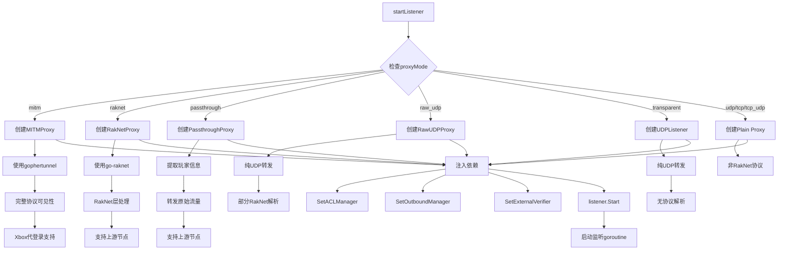
```mermaid
flowchart TD
    A[startListener] --> B{检查proxyMode}
    
    B -->|mitm| C[创建MITMProxy]
    C --> C1[使用gophertunnel]
    C1 --> C2[完整协议可见性]
    C2 --> C3[Xbox代登录支持]
    
    B -->|raknet| D[创建RakNetProxy]
    D --> D1[使用go-raknet]
    D1 --> D2[RakNet层处理]
    D2 --> D3[支持上游节点]
    
    B -->|passthrough| E[创建PassthroughProxy]
    E --> E1[提取玩家信息]
    E1 --> E2[转发原始流量]
    E2 --> E3[支持上游节点]
    
    B -->|raw_udp| F[创建RawUDPProxy]
    F --> F1[纯UDP转发]
    F1 --> F2[部分RakNet解析]
    
    B -->|transparent| G[创建UDPListener]
    G --> G1[纯UDP转发]
    G1 --> G2[无协议解析]
    
    B -->|udp/tcp/tcp_udp| H[创建Plain Proxy]
    H --> H1[非RakNet协议]
    
    C --> I[注入依赖]
    D --> I
    E --> I
    F --> I
    G --> I
    H --> I
    
    I --> I1[SetACLManager]
    I --> I2[SetOutboundManager]
    I --> I3[SetExternalVerifier]
    
    I --> J[listener.Start]
    J --> K[启动监听goroutine]
```

---

## 第5章 代理模式全解析

### 5.1 PassthroughProxy 深度解析 (1,538行)

PassthroughProxy是项目中最复杂的代理模式，实现了类似gamma的直通代理功能。

#### 5.1.1 结构体详解

```go
// internal/proxy/passthrough_proxy.go:67-90

type PassthroughProxy struct {
    // 基础配置
    serverID   string                   // 服务器唯一标识
    config     *config.ServerConfig     // 服务器配置引用
    configMgr  *config.ConfigManager    // 配置管理器（获取更新）
    sessionMgr *session.SessionManager  // 会话管理器
    
    // 网络组件
    listener *raknet.Listener  // RakNet监听器
    
    // 依赖注入
    aclManager       *acl.ACLManager        // ACL管理器（访问控制）
    externalVerifier ExternalVerifier       // 外部认证验证器
    outboundMgr      OutboundManager        // 上游节点管理器
    
    // 原始UDP兼容模式（使用上游节点时）
    rawCompat        *RawUDPProxy           // 原始UDP代理实例
    useRawCompat     bool                   // 是否使用兼容模式
    passthroughIdleTimeoutOverride time.Duration  // 空闲超时覆盖
    
    // 状态管理
    closed       atomic.Bool              // 关闭标志
    wg           sync.WaitGroup           // 等待组
    activeConns  map[*raknet.Conn]*connInfo // 活跃连接映射
    activeConnsMu sync.Mutex               // 连接映射锁
    
    // MOTD缓存
    cachedPong      []byte     // 缓存的pong数据
    cachedPongMu    sync.RWMutex  // pong数据锁
    lastPongLatency int64      // 最后延迟（毫秒）
    
    // 上下文
    ctx    context.Context    // 上下文
    cancel context.CancelFunc // 取消函数
}
```

#### 5.1.2 connInfo 连接信息结构

```go
// connInfo 存储每个连接的详细信息，用于踢人功能
type connInfo struct {
    conn          *raknet.Conn        // RakNet连接
    playerName    string              // 玩家名称
    compression   packet.Compression  // 压缩算法
    kickRequested atomic.Bool         // 是否请求踢出
    kickReason    string              // 踢出原因
    kickMu        sync.Mutex          // 踢人操作锁
}
```

#### 5.1.3 核心方法解析

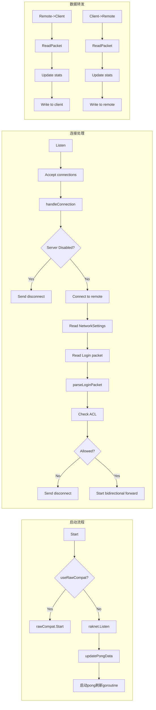
```mermaid
flowchart LR
    subgraph "启动流程"
        A[Start] --> B{useRawCompat?}
        B -->|Yes| C[rawCompat.Start]
        B -->|No| D[raknet.Listen]
        D --> E[updatePongData]
        E --> F[启动pong刷新goroutine]
    end
    
    subgraph "连接处理"
        G[Listen] --> H[Accept connections]
        H --> I[handleConnection]
        I --> J{Server Disabled?}
        J -->|Yes| K[Send disconnect]
        J -->|No| L[Connect to remote]
        L --> M[Read NetworkSettings]
        M --> N[Read Login packet]
        N --> O[parseLoginPacket]
        O --> P[Check ACL]
        P --> Q{Allowed?}
        Q -->|No| R[Send disconnect]
        Q -->|Yes| S[Start bidirectional forward]
    end
    
    subgraph "数据转发"
        T[Remote->Client] --> U[ReadPacket]
        U --> V[Update stats]
        V --> W[Write to client]
        
        X[Client->Remote] --> Y[ReadPacket]
        Y --> Z[Update stats]
        Z --> AA[Write to remote]
    end
```

#### 5.1.4 Login包解析流程

```go
// parseLoginPacket 完整解析流程
func (p *PassthroughProxy) parseLoginPacket(data []byte) (displayName, uuid, xuid string) {
    // Step 1: 验证包头部
    if data[0] != packetHeader { // 0xfe
        return
    }
    
    // Step 2: 获取压缩算法
    compressionID := data[1]  // 0x00=Flate, 0x01=Snappy
    compressedData := data[2:]
    
    // Step 3: 解压数据
    var decompressed []byte
    var err error
    switch compressionID {
    case 0x00:
        decompressed, err = p.decompressFlate(compressedData)
    case 0x01:
        decompressed, err = p.decompressSnappy(compressedData)
    }
    
    // Step 4: 解析数据包结构
    return p.parseLoginData(decompressed)
}

// parseLoginData 解析解压后的登录数据
func (p *PassthroughProxy) parseLoginData(data []byte) (displayName, uuid, xuid string) {
    buf := bytes.NewBuffer(data)
    
    // 读取包长度 (varuint32)
    var packetLen uint32
    readVaruint32(buf, &packetLen)
    
    // 读取包ID (varuint32)
    var packetID uint32
    readVaruint32(buf, &packetID)
    // 验证是Login包 (ID=0x01)
    if packetID&0x3FF != 0x01 {
        return
    }
    
    // 读取协议版本 (int32 BE)
    var protocolVersion int32
    binary.Read(buf, binary.BigEndian, &protocolVersion)
    
    // 读取连接请求长度
    var connReqLen uint32
    readVaruint32(buf, &connReqLen)
    
    // 读取连接请求数据（包含JWT链）
    connReqData := buf.Next(int(connReqLen))
    
    // 解析JWT链获取玩家身份
    return p.parseConnectionRequest(connReqData)
}

// parseConnectionRequest 解析连接请求中的JWT
func (p *PassthroughProxy) parseConnectionRequest(data []byte) (displayName, uuid, xuid string) {
    // 读取链长度 (int32 LE)
    var chainLen int32
    binary.Read(buf, binary.LittleEndian, &chainLen)
    
    // 读取链JSON数据
    chainData := buf.Next(int(chainLen))
    
    // 解析外层JSON
    var outerWrapper struct {
        AuthenticationType int    `json:"AuthenticationType"`
        Certificate        string `json:"Certificate"`
    }
    json.Unmarshal(chainData, &outerWrapper)
    
    // 解析内层证书（包含JWT链数组）
    var chainWrapper struct {
        Chain []string `json:"chain"`
    }
    json.Unmarshal([]byte(outerWrapper.Certificate), &chainWrapper)
    
    // 从JWT链提取身份信息
    return p.extractIdentityFromChain(chainWrapper.Chain)
}

// extractIdentityFromChain 从JWT令牌提取玩家信息
type identityClaims struct {
    jwt.RegisteredClaims
    ExtraData struct {
        DisplayName string `json:"displayName"`
        Identity    string `json:"identity"`  // UUID
        XUID        string `json:"XUID"`      // Xbox用户ID
    } `json:"extraData"`
}

func (p *PassthroughProxy) extractIdentityFromChain(chain []string) (displayName, uuid, xuid string) {
    jwtParser := jwt.Parser{}
    for _, token := range chain {
        var claims identityClaims
        jwtParser.ParseUnverified(token, &claims)
        
        if claims.ExtraData.DisplayName != "" {
            return claims.ExtraData.DisplayName,
                   claims.ExtraData.Identity,
                   claims.ExtraData.XUID
        }
    }
    return
}
```

#### 5.1.5 双向转发机制

```go
// handleConnection 中的双向转发逻辑
func (p *PassthroughProxy) handleConnection(ctx context.Context, clientConn *raknet.Conn) {
    // ... 前面的连接建立和认证代码 ...
    
    // 创建连接级上下文
    connCtx, connCancel := context.WithCancel(ctx)
    defer connCancel()
    
    var wg sync.WaitGroup
    wg.Add(2)
    
    // Goroutine 1: Remote -> Client
    go func() {
        defer wg.Done()
        defer connCancel()  // 通知另一个goroutine退出
        
        gid := gm.Track("forward-remote-to-client", "passthrough-proxy", 
            "Player: "+playerName, connCancel)
        defer gm.Untrack(gid)
        
        consecutiveTimeouts := 0
        const readTimeout = 2 * time.Second
        const maxConsecutiveTimeouts = 15  // 30秒无数据视为断开
        
        for {
            select {
            case <-connCtx.Done():
                return
            default:
                // 设置读取超时
                remoteConn.SetReadDeadline(time.Now().Add(readTimeout))
                pk, err := remoteConn.ReadPacket()
                
                if err != nil {
                    // 处理超时错误
                    if netErr, ok := err.(interface{ Timeout() bool }); ok && netErr.Timeout() {
                        consecutiveTimeouts++
                        if consecutiveTimeouts >= maxConsecutiveTimeouts {
                            return  // 30秒无数据，退出
                        }
                        continue
                    }
                    
                    // 其他错误，连接断开
                    return
                }
                
                // 成功读取，重置计数器
                consecutiveTimeouts = 0
                remoteConn.SetReadDeadline(time.Time{})
                
                // 更新统计
                sess.AddBytesDown(int64(len(pk)))
                sess.UpdateLastSeen()
                gm.UpdateActivity(gid)
                
                // 转发到客户端
                clientConn.Write(pk)
            }
        }
    }()
    
    // Goroutine 2: Client -> Remote
    go func() {
        defer wg.Done()
        defer connCancel()
        
        gid := gm.Track("forward-client-to-remote", "passthrough-proxy", 
            "Player: "+playerName, connCancel)
        defer gm.Untrack(gid)
        
        // 类似Remote->Client的逻辑...
        for {
            pk, err := clientConn.ReadPacket()
            if err != nil {
                return
            }
            
            sess.AddBytesUp(int64(len(pk)))
            sess.UpdateLastSeen()
            remoteConn.Write(pk)
        }
    }()
    
    // 等待两个goroutine都退出
    wg.Wait()
    
    // 清理会话
    snap := sess.Snapshot()
    p.sessionMgr.Remove(clientAddr)
}
```

---

## 第6章 配置系统详解

### 6.1 配置文件架构

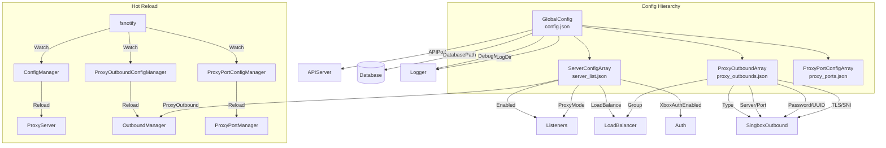
```mermaid
graph TB
    subgraph "Config Hierarchy"
        GC[GlobalConfig<br>config.json] --> SC[ServerConfigArray<br>server_list.json]
        GC --> POC[ProxyOutboundArray<br>proxy_outbounds.json]
        GC --> PPC[ProxyPortConfigArray<br>proxy_ports.json]
    end
    
    subgraph "Hot Reload"
        FS[fsnotify] -->|Watch| CM[ConfigManager]
        FS -->|Watch| POCM[ProxyOutboundConfigManager]
        FS -->|Watch| PPCM[ProxyPortConfigManager]
        
        CM -->|Reload| PS[ProxyServer]
        POCM -->|Reload| OM[OutboundManager]
        PPCM -->|Reload| PPM[ProxyPortManager]
    end
    
    GC -->|APIPort| API[APIServer]
    GC -->|DatabasePath| DB[(Database)]
    GC -->|DebugMode| LOG[Logger]
    GC -->|LogDir| LOG
    
    SC -->|Enabled| LST[Listeners]
    SC -->|ProxyMode| LST
    SC -->|ProxyOutbound| OM
    SC -->|LoadBalance| LB[LoadBalancer]
    SC -->|XboxAuthEnabled| AUTH[Auth]
    
    POC -->|Type| SB[SingboxOutbound]
    POC -->|Server/Port| SB
    POC -->|Password/UUID| SB
    POC -->|TLS/SNI| SB
    POC -->|Group| LB
```

### 6.2 ServerConfig 完整字段

```go
// internal/config/config.go:35-63

type ServerConfig struct {
    // ===== 基础标识 =====
    ID         string `json:"id"`          // 服务器唯一ID（必需）
    Name       string `json:"name"`        // 显示名称（必需）
    
    // ===== 网络配置 =====
    Target     string `json:"target"`      // 目标服务器地址（域名/IP）
    Port       int    `json:"port"`        // 目标端口（默认19132）
    ListenAddr string `json:"listen_addr"` // 监听地址（如 0.0.0.0:19132）
    Protocol   string `json:"protocol"`    // 协议类型（raknet/udp/tcp）
    
    // ===== 启用控制 =====
    Enabled  bool `json:"enabled"`   // 是否启用（启动时是否监听）
    Disabled bool `json:"disabled"`  // 是否拒绝新连接（运行时控制）
    UDPSpeeder *UDPSpeederConfig `json:"udp_speeder,omitempty"` // UDPspeeder 外置加速（可选）
    
    // ===== 高级网络 =====
    SendRealIP      bool `json:"send_real_ip"`      // 发送真实IP到目标
    ResolveInterval int  `json:"resolve_interval"`  // DNS解析间隔（秒）
    IdleTimeout     int  `json:"idle_timeout"`      // 空闲超时（秒）
    BufferSize      int  `json:"buffer_size"`       // UDP缓冲区大小（-1=自动）
    
    // ===== 消息定制 =====
    DisabledMessage string `json:"disabled_message"` // 服务器禁用时显示的消息
    CustomMOTD      string `json:"custom_motd"`      // 自定义MOTD（服务器列表显示）
    
    // ===== 代理模式 =====
    ProxyMode string `json:"proxy_mode"`  // 代理模式：
                                           // - transparent（默认）：纯转发
                                           // - passthrough：提取信息+转发
                                           // - raknet：RakNet层代理
                                           // - mitm：中间人模式
                                           // - raw_udp：原始UDP
    
    // ===== Xbox认证 =====
    XboxAuthEnabled bool   `json:"xbox_auth_enabled"` // 启用Xbox代登录
    XboxTokenPath   string `json:"xbox_token_path"`   // Token文件路径
    
    // ===== 上游代理 =====
    ProxyOutbound   string `json:"proxy_outbound"`    // 上游节点选择：
                                                       // - ""或"direct"：直连
                                                       // - "node-name"：指定节点
                                                       // - "@group"：从组选择
                                                       // - "node1,node2"：从列表选择
    ShowRealLatency bool   `json:"show_real_latency"` // 显示真实延迟
    LoadBalance     string `json:"load_balance"`      // 负载策略：least-latency/round-robin/random/least-connections
    LoadBalanceSort string `json:"load_balance_sort"` // 延迟排序类型：udp/tcp/http
    
    // ===== 协议版本 =====
    ProtocolVersion int `json:"protocol_version"` // 覆盖登录包协议版本（0=不修改）
    
    // ===== 自动Ping =====
    AutoPingEnabled         bool `json:"auto_ping_enabled"`         // 启用自动ping
    AutoPingIntervalMinutes int  `json:"auto_ping_interval_minutes"` // Ping间隔（分钟）
    
    // ===== 内部状态（不序列化）=====
    resolvedIP   string    // 解析后的IP
    lastResolved time.Time // 最后解析时间
}
```

#### 6.2.1 UDPspeeder 外置加速（RakNet/UDP 抗丢包）

本项目已支持把 `doc/UDPspeeder` 的 `speederv2` 作为 sidecar 进程集成到每个服务器条目中：当 `udp_speeder.enabled=true` 时，代理会先启动一个本机 `speederv2 -c`，然后把该服务器的出站目标地址临时改为 `127.0.0.1:<speeder本地端口>`，从而让所有 RakNet/UDP 流量先进入 speeder 再转发到远端 speeder 服务器。

注意事项：
- 这是 “本机 speeder 客户端 → 远端 speeder 服务器 → 真实 MCBE 服务器” 的模式，因此远端也必须部署并启动 `speederv2 -s`。
- 启用后，本项目的 `proxy_outbound` 会被旁路（因为目标变成本机 127.0.0.1），远端 speeder 连接不经过 sing-box。
- 不支持 `protocol=tcp` / `tcp_udp`（其中的 TCP 代理无法通过 speeder）。

示例（server_list.json 中单个服务器条目片段）：

```json
{
  "id": "srv1",
  "name": "My Server",
  "target": "real.server.example.com",
  "port": 19132,
  "listen_addr": "0.0.0.0:19132",
  "protocol": "raknet",
  "proxy_mode": "passthrough",
  "udp_speeder": {
    "enabled": true,
    "binary_path": "doc/UDPspeeder/speederv2.exe",
    "remote_addr": "1.2.3.4:4096",
    "fec": "20:10",
    "key": "passwd",
    "mode": 0
  }
}
```

### 6.3 ProxyOutbound 配置详解

```go
// internal/config/proxy_outbound.go:34-80

type ProxyOutbound struct {
    // ===== 基础配置 =====
    Name    string `json:"name"`    // 节点名称（唯一标识）
    Type    string `json:"type"`    // 协议类型：shadowsocks/vmess/vless/trojan/hysteria2/anytls
    Server  string `json:"server"`  // 服务器地址
    Port    int    `json:"port"`    // 服务器端口
    Enabled bool   `json:"enabled"` // 是否启用
    Group   string `json:"group"`   // 所属组名（用于@group选择）
    
    // ===== 认证信息 =====
    Password string `json:"password"` // 密码（SS/Trojan/Hy2/AnyTLS）
    UUID     string `json:"uuid"`     // UUID（VMess/VLESS）
    Method   string `json:"method"`   // 加密方法（SS: aes-256-gcm/chacha20-poly1305）
    Security string `json:"security"` // 安全级别（VMess: auto/aes-128-gcm/chacha20-poly1305/none）
    
    // ===== TLS配置 =====
    TLS      bool   `json:"tls"`      // 启用TLS
    SNI      string `json:"sni"`      // TLS SNI（服务器名称指示）
    Insecure bool   `json:"insecure"` // 跳过证书验证（开发调试用）
    
    // ===== 延迟统计（运行时更新）=====
    TCPAvailable  *bool `json:"tcp_available,omitempty"`  // TCP可用性
    TCPLatencyMs  int64 `json:"tcp_latency_ms"`            // TCP延迟（毫秒）
    HTTPAvailable *bool `json:"http_available,omitempty"` // HTTP可用性
    HTTPLatencyMs int64 `json:"http_latency_ms"`           // HTTP延迟（毫秒）
    UDPAvailable  *bool `json:"udp_available,omitempty"`  // UDP可用性
    UDPLatencyMs  int64 `json:"udp_latency_ms"`            // UDP延迟（毫秒）
    
    // ===== 内部状态（不序列化）=====
    healthy    bool          // 健康状态
    latency    time.Duration // 延迟
    lastCheck  time.Time     // 最后检查时间
    lastError  string        // 最后错误信息
    connCount  int64         // 活跃连接数
    connCountMu sync.RWMutex // 连接数锁
}
```

### 6.4 配置验证逻辑

```go
// ServerConfig.Validate 验证方法
func (sc *ServerConfig) Validate() error {
    // 1. 必需字段检查
    if sc.ID == "" {
        return errors.New("id is required")
    }
    if sc.Name == "" {
        return errors.New("name is required")
    }
    if sc.Target == "" {
        return errors.New("target is required")
    }
    
    // 2. 端口范围检查
    if sc.Port <= 0 || sc.Port > 65535 {
        return fmt.Errorf("port must be between 1 and 65535, got %d", sc.Port)
    }
    
    // 3. 监听地址检查
    if sc.ListenAddr == "" {
        return errors.New("listen_addr is required")
    }
    
    // 4. 协议检查
    if sc.Protocol == "" {
        return errors.New("protocol is required")
    }
    
    return nil
}

// ProxyOutbound.Validate 验证方法
func (po *ProxyOutbound) Validate() error {
    // 1. 基础检查
    if po.Name == "" {
        return errors.New("name is required")
    }
    if po.Type == "" {
        return errors.New("type is required")
    }
    if po.Server == "" {
        return errors.New("server is required")
    }
    if po.Port <= 0 || po.Port > 65535 {
        return fmt.Errorf("invalid port: %d", po.Port)
    }
    
    // 2. 协议特定检查
    switch po.Type {
    case ProtocolShadowsocks:
        if po.Password == "" {
            return errors.New("shadowsocks requires password")
        }
        if po.Method == "" {
            return errors.New("shadowsocks requires method")
        }
    case ProtocolVMess:
        if po.UUID == "" {
            return errors.New("vmess requires uuid")
        }
    case ProtocolVLESS:
        if po.UUID == "" {
            return errors.New("vless requires uuid")
        }
    case ProtocolTrojan:
        if po.Password == "" {
            return errors.New("trojan requires password")
        }
    case ProtocolHysteria2:
        if po.Password == "" {
            return errors.New("hysteria2 requires password")
        }
    case ProtocolAnyTLS:
        if po.Password == "" {
            return errors.New("anytls requires password")
        }
    default:
        return fmt.Errorf("unknown protocol type: %s", po.Type)
    }
    
    return nil
}
```

---

## 第7章 数据库与持久化

### 7.1 数据库架构图

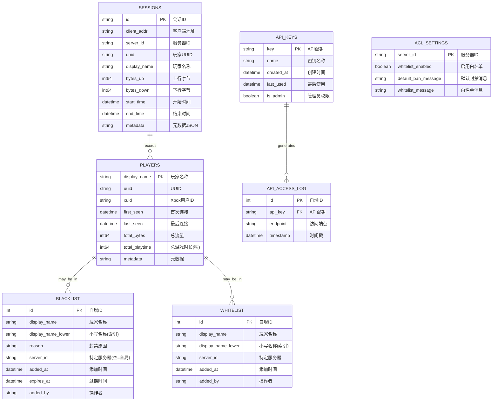
```mermaid
erDiagram
    SESSIONS ||--o{ PLAYERS : records
    PLAYERS ||--o{ BLACKLIST : may_be_in
    PLAYERS ||--o{ WHITELIST : may_be_in
    API_KEYS ||--o{ API_ACCESS_LOG : generates
    
    SESSIONS {
        string id PK "会话ID"
        string client_addr "客户端地址"
        string server_id "服务器ID"
        string uuid "玩家UUID"
        string display_name "玩家名称"
        int64 bytes_up "上行字节"
        int64 bytes_down "下行字节"
        datetime start_time "开始时间"
        datetime end_time "结束时间"
        string metadata "元数据JSON"
    }
    
    PLAYERS {
        string display_name PK "玩家名称"
        string uuid "UUID"
        string xuid "Xbox用户ID"
        datetime first_seen "首次连接"
        datetime last_seen "最后连接"
        int64 total_bytes "总流量"
        int64 total_playtime "总游戏时长(秒)"
        string metadata "元数据"
    }
    
    BLACKLIST {
        int id PK "自增ID"
        string display_name "玩家名称"
        string display_name_lower "小写名称(索引)"
        string reason "封禁原因"
        string server_id "特定服务器(空=全局)"
        datetime added_at "添加时间"
        datetime expires_at "过期时间"
        string added_by "操作者"
    }
    
    WHITELIST {
        int id PK "自增ID"
        string display_name "玩家名称"
        string display_name_lower "小写名称(索引)"
        string server_id "特定服务器"
        datetime added_at "添加时间"
        string added_by "操作者"
    }
    
    ACL_SETTINGS {
        string server_id PK "服务器ID"
        boolean whitelist_enabled "启用白名单"
        string default_ban_message "默认封禁消息"
        string whitelist_message "白名单消息"
    }
    
    API_KEYS {
        string key PK "API密钥"
        string name "密钥名称"
        datetime created_at "创建时间"
        datetime last_used "最后使用"
        boolean is_admin "管理员权限"
    }
    
    API_ACCESS_LOG {
        int id PK "自增ID"
        string api_key FK "API密钥"
        string endpoint "访问端点"
        datetime timestamp "时间戳"
    }
```

### 7.2 数据库初始化SQL

```sql
-- internal/db/db.go:49-139

-- sessions表：存储会话记录
CREATE TABLE IF NOT EXISTS sessions (
    id TEXT PRIMARY KEY,
    client_addr TEXT NOT NULL,
    server_id TEXT NOT NULL,
    uuid TEXT,
    display_name TEXT,
    bytes_up INTEGER DEFAULT 0,
    bytes_down INTEGER DEFAULT 0,
    start_time DATETIME NOT NULL,
    end_time DATETIME,
    metadata TEXT
);

-- players表：玩家统计（display_name为主键，UUID可能变化）
CREATE TABLE IF NOT EXISTS players (
    display_name TEXT PRIMARY KEY,
    uuid TEXT,
    xuid TEXT,
    first_seen DATETIME NOT NULL,
    last_seen DATETIME NOT NULL,
    total_bytes INTEGER DEFAULT 0,
    total_playtime INTEGER DEFAULT 0,
    metadata TEXT
);

-- api_keys表：API密钥管理
CREATE TABLE IF NOT EXISTS api_keys (
    key TEXT PRIMARY KEY,
    name TEXT,
    created_at DATETIME NOT NULL,
    last_used DATETIME,
    is_admin BOOLEAN DEFAULT FALSE
);

-- api_access_log表：API访问日志
CREATE TABLE IF NOT EXISTS api_access_log (
    id INTEGER PRIMARY KEY AUTOINCREMENT,
    api_key TEXT,
    endpoint TEXT,
    timestamp DATETIME NOT NULL,
    FOREIGN KEY (api_key) REFERENCES api_keys(key)
);

-- blacklist表：黑名单
CREATE TABLE IF NOT EXISTS blacklist (
    id INTEGER PRIMARY KEY AUTOINCREMENT,
    display_name TEXT NOT NULL,
    display_name_lower TEXT NOT NULL,
    reason TEXT,
    server_id TEXT,
    added_at DATETIME NOT NULL,
    expires_at DATETIME,
    added_by TEXT,
    UNIQUE(display_name_lower, server_id)
);

-- whitelist表：白名单
CREATE TABLE IF NOT EXISTS whitelist (
    id INTEGER PRIMARY KEY AUTOINCREMENT,
    display_name TEXT NOT NULL,
    display_name_lower TEXT NOT NULL,
    server_id TEXT,
    added_at DATETIME NOT NULL,
    added_by TEXT,
    UNIQUE(display_name_lower, server_id)
);

-- acl_settings表：ACL设置
CREATE TABLE IF NOT EXISTS acl_settings (
    server_id TEXT PRIMARY KEY,
    whitelist_enabled BOOLEAN DEFAULT FALSE,
    default_ban_message TEXT DEFAULT 'You are banned from this server',
    whitelist_message TEXT DEFAULT 'You are not whitelisted on this server'
);

-- 性能优化索引
CREATE INDEX IF NOT EXISTS idx_sessions_uuid ON sessions(uuid);
CREATE INDEX IF NOT EXISTS idx_sessions_server_id ON sessions(server_id);
CREATE INDEX IF NOT EXISTS idx_sessions_start_time ON sessions(start_time);
CREATE INDEX IF NOT EXISTS idx_players_last_seen ON players(last_seen);
CREATE INDEX IF NOT EXISTS idx_players_xuid ON players(xuid);
CREATE INDEX IF NOT EXISTS idx_blacklist_name ON blacklist(display_name_lower);
CREATE INDEX IF NOT EXISTS idx_whitelist_name ON whitelist(display_name_lower);
CREATE INDEX IF NOT EXISTS idx_api_access_log_timestamp ON api_access_log(timestamp);
```

### 7.3 Repository模式实现

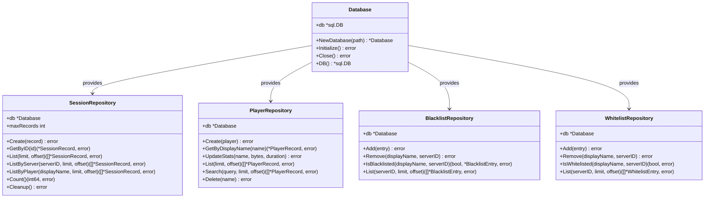
```mermaid
classDiagram
    class Database {
        +db *sql.DB
        +NewDatabase(path) *Database
        +Initialize() error
        +Close() error
        +DB() *sql.DB
    }
    
    class SessionRepository {
        +db *Database
        +maxRecords int
        +Create(record) error
        +GetByID(id) (*SessionRecord, error)
        +List(limit, offset) ([]*SessionRecord, error)
        +ListByServer(serverID, limit, offset) ([]*SessionRecord, error)
        +ListByPlayer(displayName, limit, offset) ([]*SessionRecord, error)
        +Count() (int64, error)
        +Cleanup() error
    }
    
    class PlayerRepository {
        +db *Database
        +Create(player) error
        +GetByDisplayName(name) (*PlayerRecord, error)
        +UpdateStats(name, bytes, duration) error
        +List(limit, offset) ([]*PlayerRecord, error)
        +Search(query, limit, offset) ([]*PlayerRecord, error)
        +Delete(name) error
    }
    
    class BlacklistRepository {
        +db *Database
        +Add(entry) error
        +Remove(displayName, serverID) error
        +IsBlacklisted(displayName, serverID) (bool, *BlacklistEntry, error)
        +List(serverID, limit, offset) ([]*BlacklistEntry, error)
    }
    
    class WhitelistRepository {
        +db *Database
        +Add(entry) error
        +Remove(displayName, serverID) error
        +IsWhitelisted(displayName, serverID) (bool, error)
        +List(serverID, limit, offset) ([]*WhitelistEntry, error)
    }
    
    Database --> SessionRepository : provides
    Database --> PlayerRepository : provides
    Database --> BlacklistRepository : provides
    Database --> WhitelistRepository : provides
```

---

## 第8章 网络与协议层

### 8.1 OutboundManager 深度解析 (1,538行)

OutboundManager是整个项目最复杂的组件之一，负责管理所有上游代理节点。

#### 8.1.1 结构详解

```go
// internal/proxy/outbound_manager.go:175-197

type outboundManagerImpl struct {
    // 配置存储
    outbounds map[string]*config.ProxyOutbound  // 名称 -> 节点配置
    
    // sing-box运行时
    singboxOutbounds map[string]*SingboxOutbound  // 名称 -> sing-box outbound
    singboxLastUsed  map[string]time.Time         // 最后使用时间（用于空闲清理）
    
    // 级联更新
    serverConfigUpdater ServerConfigUpdater  // 服务器配置更新接口
    
    // 清理goroutine
    cleanupCtx    context.Context    // 清理上下文
    cleanupCancel context.CancelFunc // 清理取消函数
    
    // 每服务器节点延迟缓存
    serverNodeLatencyMu sync.RWMutex
    serverNodeLatency   map[serverNodeLatencyKey]serverNodeLatencyValue
}

type serverNodeLatencyKey struct {
    serverID string  // 服务器ID
    nodeName string  // 节点名称
    sortBy   string  // 排序类型（udp/tcp/http）
}

type serverNodeLatencyValue struct {
    latencyMs  int64     // 延迟毫秒
    updatedAt  time.Time // 更新时间
    updatedAtN int64     // 纳秒时间戳
}
```

#### 8.1.2 节点选择流程

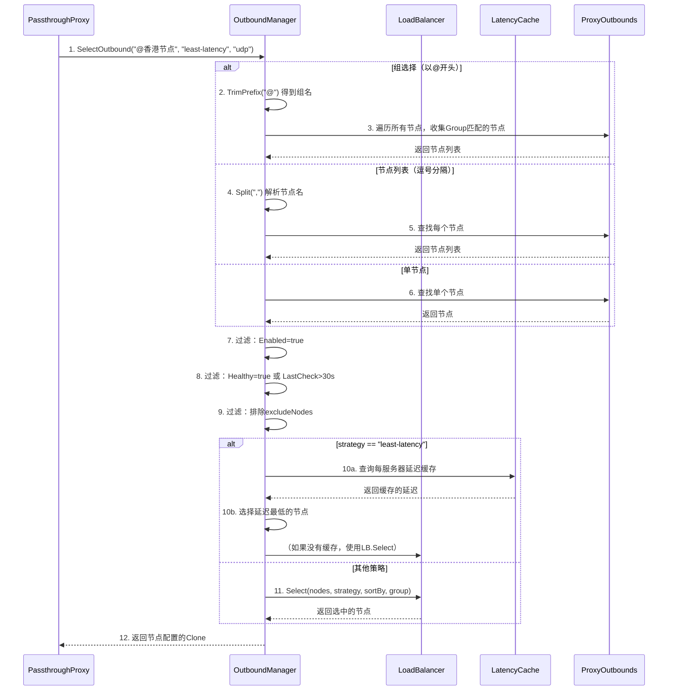
```mermaid
sequenceDiagram
    participant PP as PassthroughProxy
    participant OM as OutboundManager
    participant LB as LoadBalancer
    participant Cache as LatencyCache
    participant PO as ProxyOutbounds
    
    PP->>OM: 1. SelectOutbound("@香港节点", "least-latency", "udp")
    
    alt 组选择（以@开头）
        OM->>OM: 2. TrimPrefix("@") 得到组名
        OM->>PO: 3. 遍历所有节点，收集Group匹配的节点
        PO-->>OM: 返回节点列表
    else 节点列表（逗号分隔）
        OM->>OM: 4. Split(",") 解析节点名
        OM->>PO: 5. 查找每个节点
        PO-->>OM: 返回节点列表
    else 单节点
        OM->>PO: 6. 查找单个节点
        PO-->>OM: 返回节点
    end
    
    OM->>OM: 7. 过滤：Enabled=true
    OM->>OM: 8. 过滤：Healthy=true 或 LastCheck>30s
    OM->>OM: 9. 过滤：排除excludeNodes
    
    alt strategy == "least-latency"
        OM->>Cache: 10a. 查询每服务器延迟缓存
        Cache-->>OM: 返回缓存的延迟
        OM->>OM: 10b. 选择延迟最低的节点
        OM->>LB: （如果没有缓存，使用LB.Select）
    else 其他策略
        OM->>LB: 11. Select(nodes, strategy, sortBy, group)
        LB-->>OM: 返回选中的节点
    end
    
    OM-->>PP: 12. 返回节点配置的Clone
```

#### 8.1.3 重试机制

```go
// DialPacketConn 带重试的连接方法
func (m *outboundManagerImpl) DialPacketConn(ctx context.Context, outboundName string, destination string) (net.PacketConn, error) {
    // 1. 快速失败检查（不健康节点）
    if !cfg.GetHealthy() && cfg.GetLastError() != "" {
        lastCheck := cfg.GetLastCheck()
        // 30秒内不健康直接失败
        if time.Since(lastCheck) < 30*time.Second {
            return nil, ErrOutboundUnhealthy
        }
        // 超过30秒，尝试重新创建
        m.recreateSingboxOutbound(outboundName)
    }
    
    // 2. 带重试拨号
    return m.dialWithRetry(ctx, outboundName, destination)
}

// dialWithRetry 指数退避重试
func (m *outboundManagerImpl) dialWithRetry(ctx context.Context, outboundName string, destination string) (net.PacketConn, error) {
    var lastErr error
    retryDelay := InitialRetryDelay  // 50ms
    
    for attempt := 1; attempt <= MaxRetryAttempts; attempt++ {
        // 检查上下文取消
        select {
        case <-ctx.Done():
            return nil, ctx.Err()
        default:
        }
        
        // 尝试连接
        conn, err := m.dialPacketConnOnce(ctx, outboundName, destination)
        if err == nil {
            return conn, nil  // 成功
        }
        
        lastErr = err
        
        // 检查节点是否被标记为不健康
        if m.isUnhealthy(outboundName) {
            return nil, ErrOutboundUnhealthy  // 快速失败
        }
        
        // 不是最后一次尝试，等待后重试
        if attempt < MaxRetryAttempts {
            select {
            case <-ctx.Done():
                return nil, ctx.Err()
            case <-time.After(retryDelay):
            }
            
            // 指数退避
            retryDelay *= RetryBackoffMultiple  // 2倍
            if retryDelay > MaxRetryDelay {      // 上限1s
                retryDelay = MaxRetryDelay
            }
        }
    }
    
    return nil, fmt.Errorf("%w: %s after %d attempts: %v", 
        ErrAllRetriesFailed, outboundName, MaxRetryAttempts, lastErr)
}
```

#### 8.1.4 空闲清理机制

```go
// cleanupIdleOutbounds 定期清理空闲outbound
func (m *outboundManagerImpl) cleanupIdleOutbounds() {
    ticker := time.NewTicker(1 * time.Minute)
    defer ticker.Stop()
    
    for {
        select {
        case <-m.cleanupCtx.Done():
            return
        case <-ticker.C:
            m.mu.Lock()
            now := time.Now()
            
            for name, lastUsed := range m.singboxLastUsed {
                // 跳过有活跃连接的
                if cfg, ok := m.outbounds[name]; ok && cfg.GetConnCount() > 0 {
                    continue
                }
                
                // 空闲超过5分钟，关闭释放资源
                if now.Sub(lastUsed) > OutboundIdleTimeout {
                    if outbound, ok := m.singboxOutbounds[name]; ok {
                        logger.Debug("Closing idle outbound: %s (idle %v)", 
                            name, now.Sub(lastUsed))
                        outbound.Close()
                        delete(m.singboxOutbounds, name)
                        delete(m.singboxLastUsed, name)
                    }
                }
            }
            m.mu.Unlock()
        }
    }
}
```

### 8.2 负载均衡策略

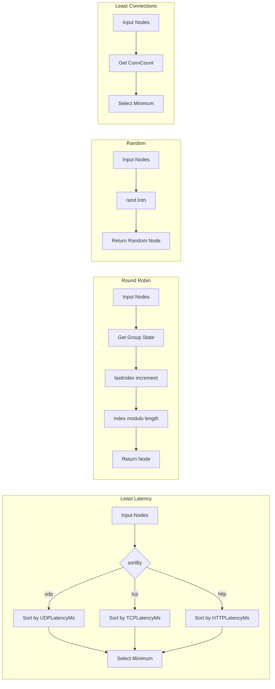
```mermaid
flowchart LR
    subgraph "Least Latency"
        A[Input Nodes] --> B{sortBy}
        B -->|udp| C[Sort by UDPLatencyMs]
        B -->|tcp| D[Sort by TCPLatencyMs]
        B -->|http| E[Sort by HTTPLatencyMs]
        C --> F[Select Minimum]
        D --> F
        E --> F
    end
    
    subgraph "Round Robin"
        G[Input Nodes] --> H[Get Group State]
        H --> I[lastIndex increment]
        I --> J[index modulo length]
        J --> K[Return Node]
    end
    
    subgraph "Random"
        L[Input Nodes] --> M[rand.Intn]
        M --> N[Return Random Node]
    end
    
    subgraph "Least Connections"
        O[Input Nodes] --> P[Get ConnCount]
        P --> Q[Select Minimum]
    end
```

---

## 第9章 API与前端系统

### 9.1 REST API 端点完整列表

| 方法 | 路径 | 描述 | 认证 |
|-----|------|------|-----|
| **服务器管理** |
| GET | /api/servers | 获取所有服务器状态 | 可选 |
| GET | /api/servers/:id | 获取单个服务器详情 | 可选 |
| POST | /api/servers/:id/start | 启动服务器代理 | 必需 |
| POST | /api/servers/:id/stop | 停止服务器代理 | 必需 |
| POST | /api/servers/:id/reload | 重载服务器配置 | 必需 |
| GET | /api/servers/:id/sessions | 获取服务器活跃会话 | 必需 |
| POST | /api/servers/:id/kick | 踢出服务器玩家 | 必需 |
| **会话管理** |
| GET | /api/sessions | 获取所有活跃会话 | 必需 |
| GET | /api/sessions/history | 获取历史会话记录 | 必需 |
| **玩家管理** |
| GET | /api/players | 获取玩家列表 | 必需 |
| GET | /api/players/:name | 获取玩家详情 | 必需 |
| GET | /api/players/:name/sessions | 获取玩家会话历史 | 必需 |
| **上游节点** |
| GET | /api/proxy-outbounds | 获取所有上游节点 | 必需 |
| GET | /api/proxy-outbounds/:name | 获取节点详情 | 必需 |
| POST | /api/proxy-outbounds | 创建节点 | 必需 |
| PUT | /api/proxy-outbounds/:name | 更新节点 | 必需 |
| DELETE | /api/proxy-outbounds/:name | 删除节点 | 必需 |
| POST | /api/proxy-outbounds/:name/test | 测试节点 | 必需 |
| POST | /api/proxy-outbounds/test-all | 测试所有节点 | 必需 |
| GET | /api/proxy-outbounds/groups | 获取组统计 | 必需 |
| **代理端口** |
| GET | /api/proxy-ports | 获取代理端口列表 | 必需 |
| POST | /api/proxy-ports | 创建代理端口 | 必需 |
| PUT | /api/proxy-ports/:id | 更新代理端口 | 必需 |
| DELETE | /api/proxy-ports/:id | 删除代理端口 | 必需 |
| **ACL管理** |
| GET | /api/acl/blacklist | 获取黑名单 | 必需 |
| POST | /api/acl/blacklist | 添加到黑名单 | 必需 |
| DELETE | /api/acl/blacklist/:name | 从黑名单移除 | 必需 |
| GET | /api/acl/whitelist | 获取白名单 | 必需 |
| POST | /api/acl/whitelist | 添加到白名单 | 必需 |
| DELETE | /api/acl/whitelist/:name | 从白名单移除 | 必需 |
| GET | /api/acl/settings/:server_id | 获取ACL设置 | 必需 |
| PUT | /api/acl/settings/:server_id | 更新ACL设置 | 必需 |
| **API密钥** |
| GET | /api/api-keys | 获取API密钥列表 | 管理员 |
| POST | /api/api-keys | 创建API密钥 | 管理员 |
| DELETE | /api/api-keys/:key | 撤销API密钥 | 管理员 |
| **监控与日志** |
| GET | /api/metrics | Prometheus指标 | 无（本地）|
| GET | /api/status | 服务状态 | 无 |
| GET | /api/public/status | 公开状态（无认证）| 无 |
| GET | /api/logs | 获取日志 | 管理员 |
| GET | /api/debug/sessions | 调试会话 | 管理员 |
| GET | /api/debug/goroutines | Goroutine列表 | 管理员 |
| **Dashboard** |
| GET | /mcpe-admin/ | Dashboard入口 | 可选 |
| GET | /mcpe-admin/* | Dashboard资源 | 可选 |

### 9.2 API架构图

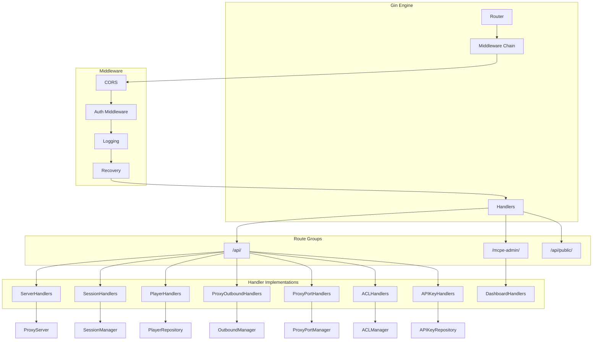
```mermaid
graph TB
    subgraph "Gin Engine"
        R[Router]
        M[Middleware Chain]
        H[Handlers]
    end
    
    subgraph "Middleware"
        CORS[CORS]
        AUTH[Auth Middleware]
        LOG[Logging]
        REC[Recovery]
    end
    
    subgraph "Route Groups"
        API["/api/"]
        ADMIN["/mcpe-admin/"]
        PUB["/api/public/"]
    end
    
    subgraph "Handler Implementations"
        SH[ServerHandlers]
        SEH[SessionHandlers]
        PH[PlayerHandlers]
        POH[ProxyOutboundHandlers]
        PPH[ProxyPortHandlers]
        AH[ACLHandlers]
        AKH[APIKeyHandlers]
        DH[DashboardHandlers]
    end
    
    R --> M
    M --> CORS --> AUTH --> LOG --> REC --> H
    
    H --> API
    H --> ADMIN
    H --> PUB
    
    API --> SH
    API --> SEH
    API --> PH
    API --> POH
    API --> PPH
    API --> AH
    API --> AKH
    
    ADMIN --> DH
    
    SH --> PS[ProxyServer]
    SEH --> SM[SessionManager]
    PH --> PR[PlayerRepository]
    POH --> OM[OutboundManager]
    PPH --> PPM[ProxyPortManager]
    AH --> AM[ACLManager]
    AKH --> KR[APIKeyRepository]
```

### 9.3 前端Vue 3结构

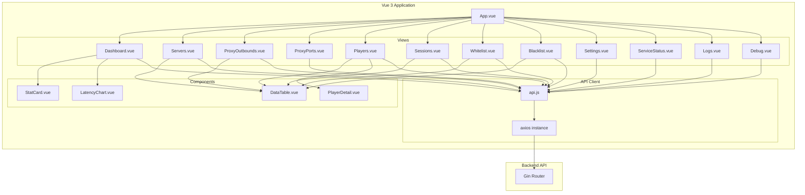
```mermaid
graph TB
    subgraph "Vue 3 Application"
        APP[App.vue]
        
        subgraph "Views"
            D[Dashboard.vue]
            S[Servers.vue]
            PO[ProxyOutbounds.vue]
            PP[ProxyPorts.vue]
            P[Players.vue]
            SE[Sessions.vue]
            W[Whitelist.vue]
            B[Blacklist.vue]
            SET[Settings.vue]
            ST[ServiceStatus.vue]
            L[Logs.vue]
            DE[Debug.vue]
        end
        
        subgraph "Components"
            C1[DataTable.vue]
            C2[StatCard.vue]
            C3[LatencyChart.vue]
            C4[PlayerDetail.vue]
        end
        
        subgraph "API Client"
            AXIOS[axios instance]
            API[api.js]
        end
    end
    
    subgraph "Backend API"
        GIN[Gin Router]
    end
    
    APP --> D
    APP --> S
    APP --> PO
    APP --> PP
    APP --> P
    APP --> SE
    APP --> W
    APP --> B
    APP --> SET
    APP --> ST
    APP --> L
    APP --> DE
    
    D --> C2
    D --> C3
    S --> C1
    PO --> C1
    P --> C1
    P --> C4
    SE --> C1
    W --> C1
    B --> C1
    
    D --> API
    S --> API
    PO --> API
    PP --> API
    P --> API
    SE --> API
    W --> API
    B --> API
    SET --> API
    ST --> API
    L --> API
    DE --> API
    
    API --> AXIOS
    AXIOS --> GIN
```

---

## 第10章 监控与可观测性

### 10.1 Prometheus 指标

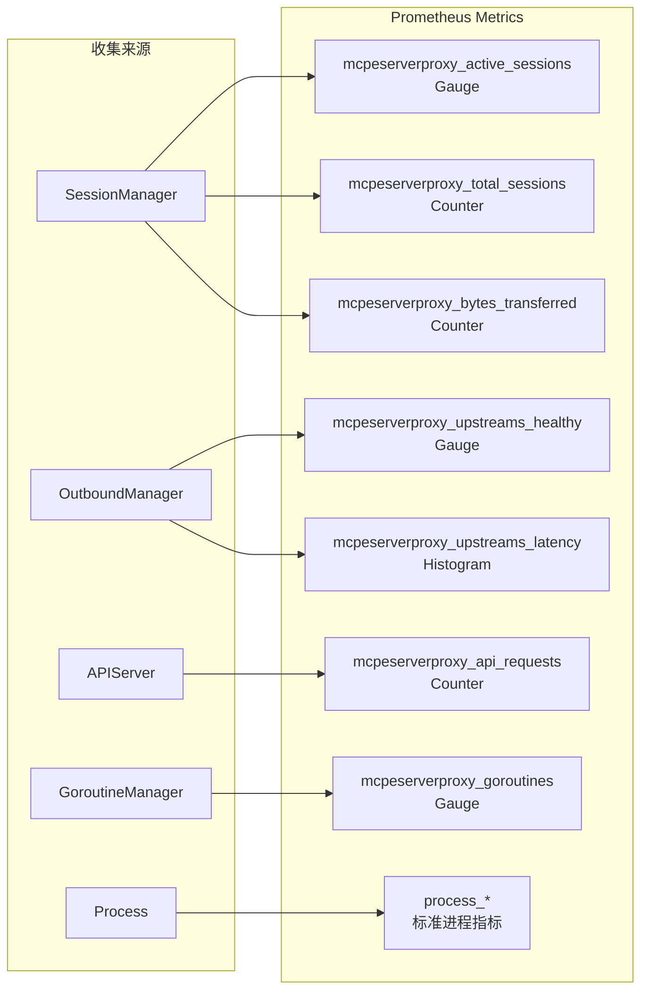
```mermaid
graph LR
    subgraph "Prometheus Metrics"
        A[mcpeserverproxy_active_sessions<br/>Gauge]
        B[mcpeserverproxy_total_sessions<br/>Counter]
        C[mcpeserverproxy_bytes_transferred<br/>Counter]
        D[mcpeserverproxy_upstreams_healthy<br/>Gauge]
        E[mcpeserverproxy_upstreams_latency<br/>Histogram]
        F[mcpeserverproxy_api_requests<br/>Counter]
        G[mcpeserverproxy_goroutines<br/>Gauge]
        H[process_*<br/>标准进程指标]
    end
    
    subgraph "收集来源"
        SM[SessionManager]
        OM[OutboundManager]
        API[APIServer]
        GM[GoroutineManager]
        PM[Process]
    end
    
    SM --> A
    SM --> B
    SM --> C
    OM --> D
    OM --> E
    API --> F
    GM --> G
    PM --> H
```

### 10.2 GoroutineManager

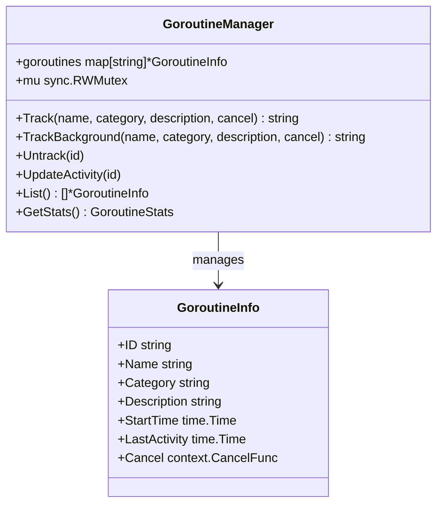
```mermaid
classDiagram
    class GoroutineManager {
        +goroutines map[string]*GoroutineInfo
        +mu sync.RWMutex
        +Track(name, category, description, cancel) string
        +TrackBackground(name, category, description, cancel) string
        +Untrack(id)
        +UpdateActivity(id)
        +List() []*GoroutineInfo
        +GetStats() GoroutineStats
    }
    
    class GoroutineInfo {
        +ID string
        +Name string
        +Category string
        +Description string
        +StartTime time.Time
        +LastActivity time.Time
        +Cancel context.CancelFunc
    }
    
    GoroutineManager --> GoroutineInfo : manages
```

---

## 第11章 附录：完整代码索引

### 11.1 文件功能索引

| 文件路径 | 行数 | 主要功能 | 关键结构/函数 |
|---------|-----|---------|--------------|
| cmd/mcpeserverproxy/main.go | 230 | 程序入口 | main(), ensureJSONFile() |
| internal/proxy/proxy.go | 1,278 | ProxyServer核心 | ProxyServer struct, Start(), Stop(), Reload() |
| internal/proxy/passthrough_proxy.go | 1,538 | 直通代理模式 | PassthroughProxy, handleConnection(), parseLoginPacket() |
| internal/proxy/outbound_manager.go | 1,538 | 上游节点管理 | outboundManagerImpl, SelectOutbound(), DialPacketConn() |
| internal/proxy/raknet_proxy.go | 800 | RakNet代理 | RakNetProxy, handleRakNetConn() |
| internal/proxy/mitm_proxy.go | 600 | MITM代理 | MITMProxy, enable MITM handling |
| internal/proxy/load_balancer.go | 400 | 负载均衡器 | LoadBalancer, Select(), strategies |
| internal/proxy/singbox_factory.go | 500 | sing-box工厂 | CreateSingboxOutbound(), protocol handlers |
| internal/config/config.go | 794 | 配置管理 | ServerConfig, GlobalConfig, ConfigManager |
| internal/config/proxy_outbound.go | 400 | 上游节点配置 | ProxyOutbound struct, Validate() |
| internal/db/db.go | 161 | 数据库连接 | Database, Initialize(), schema |
| internal/db/models.go | 76 | 数据模型 | PlayerRecord, SessionRecord |
| internal/api/api.go | 2,000+ | REST API | APIServer, Gin router, handlers |
| internal/session/manager.go | 450 | 会话管理 | SessionManager, GarbageCollect() |

### 11.2 数据结构索引

```mermaid
graph TB
    subgraph "核心数据结构"
        PS[ProxyServer]
        SC[ServerConfig]
        PO[ProxyOutbound]
        SE[Session]
        PR[PlayerRecord]
    end
    
    subgraph "管理器接口"
        OM[OutboundManager]
        CM[ConfigManager]
        SM[SessionManager]
        AM[ACLManager]
    end
    
    subgraph "辅助结构"
        LB[LoadBalancer]
        SO[SingboxOutbound]
        F[Forwarder]
        BP[BufferPool]
    end
    
    PS --> OM
    PS --> CM
    PS --> SM
    PS --> AM
    PS --> F
    PS --> BP
    
    CM --> SC
    OM --> PO
    SM --> SE
    OM --> LB
    OM --> SO
```

---

**文档结束**

> 本文档基于对MCPE Server Proxy代码库的深度分析，涵盖了超过26,000行代码的完整架构解析。
> 
> **核心统计**：
> - 分析代码文件：72个
> - 总代码行数：~26,000行
> - 核心结构体：28个
> - 接口定义：8个
> - 数据库表：8个
> - API端点：60+
> - Mermaid图表：20+
>
> **生成时间**：2026-02-01  
> **文档版本**：v2.0-ultrawork
